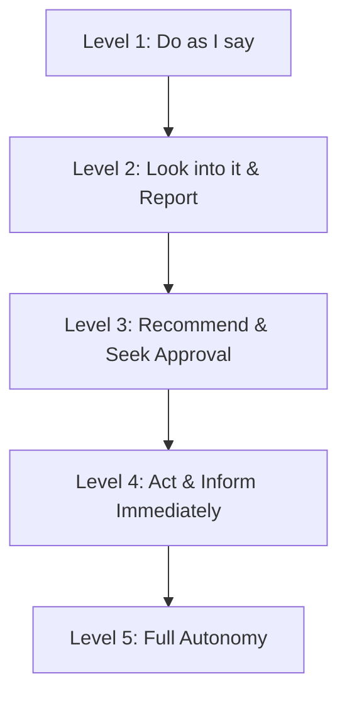

# Delegation Level Matrix: Breaking Heroic Leadership and Reverse Delegation

> **Standards Alignment**: `ICPM: Delegation & Operational Control` | `CMI: Personal Effectiveness & Empowering Others`  
> **Core Toolkit**: J. Richard Hackman Authority Levels, Delegation of Authority (DoA) Governance

---

## 1. The Pain Point Scenario

!!! danger "The Classic Management Trap: The Monkey Back on Your Shoulder"
    **"A manager delegates a critical project to a subordinate. A week later, the subordinate enters the office saying: 'Boss, cross-departmental coordination is stuck. What should we do?' The manager sighs: 'Alright, leave it on my desk, I'll handle it.' Gradually, the team's operational load piles back onto the manager, turning them into the primary organizational bottleneck."**

### Core Symptom Diagnosis
* **Binary Delegation Trap**: Falling into the false dichotomy of either complete micromanagement or total abandonment.
* **The Heroic Leadership Myth**: The manager's psychological need to feel indispensable, which inadvertently crushes subordinate accountability.
* **Reverse Delegation**: Failing to set boundaries, allowing team members to pass unresolved problems and decisions back up the hierarchy.

---

## 2. Theoretical Framework: The 5 Levels of Delegation

Effective delegation is not binary; it is an incremental ladder calibrated against task risk and subordinate maturity:



### Delegation Level Matrix

| Level | Scope of Authority | Decision Ownership | Context & Applicability |
| --- | --- | --- | --- |
| **Level 1: Do as I say** | Execute strict instructions with zero decision latitude | Manager (100%) | Onboarding, compliance emergencies, high legal liability |
| **Level 2: Look into it & Report** | Subordinate gathers facts and options; manager decides | Manager (100%) | Complex market research, vendor bidding analysis |
| **Level 3: Recommend & Seek Approval** | Subordinate must provide recommended options with rationale | Manager (Subordinate-led) | Core operational workflows, moderate cross-functional tasks |
| **Level 4: Act & Inform Immediately** | Subordinate decides and acts, followed by immediate logging | Subordinate (80%) / Manager (20%) | Experienced performers, operational tasks within budget |
| **Level 5: Full Autonomy** | Full discretion; reviewed during periodic performance audits | Subordinate (100%) | Senior domain experts, standardized mature processes |

---

## 3. Critical Perspectives & Governance Boundaries

!!! warning "Delegation is NOT Abdication"
* **Accountability Cannot be Delegated**: According to governance standards (ISO 37000 / Corporate DoA), a manager may delegate **Execution Authority**, but **Ultimate Accountability** permanently resides with the manager.
* **Span of Control Realities**: While classical theory prescribes 5-7 direct reports, modern agile structures can scale span of control to 15-20 when operational processes are mature and teams operate at Level 4/5.

---

## 4. Certification Alignment

=== "ICPM (Certified Manager) Focus"
* **Assessment Dimension**: `Management Functions - Organizing & Leading`
* **High-Frequency Question**: How to dismantle "Reverse Delegation"? The correct response is acting as a **coach to develop the subordinate's problem-solving capacity, rather than reclaiming task execution**.

=== "CMI (Chartered Manager) Focus"
* **Assessment Dimension**: `Empowering Others & Operational Performance`
* **Practical Expectation**: Demonstrating structured empowerment via clear **risk boundaries and milestone check-ins**.

---

## 5. Actionable Toolkit: Coaching Scripts & 90-Day Plan

### 3 Coaching Responses to Defend Against Reverse Delegation

> ❌ **Ineffective Response**: "Fine, it's urgent, leave it here and I'll do it."
> 💡 **Script 1 (Demand Options)**: "Before bringing this back, what two alternatives did you explore, and which one do you personally recommend?"
> 💡 **Script 2 (Enforce Boundaries)**: "This task operates at Level 3. You must come to me with an analysis and a proposed solution, not just the problem."
> 💡 **Script 3 (Empowerment)**: "What specific mandate or organizational resource do you need from me so that YOU can see this through to completion?"

---

!!! success "New Manager 90-Day Progressive Delegation Plan"
- [ ] **Days 1-30 (Boundary Audit)**: Classify all ongoing tasks into "strictly executive-owned" versus "delegable operational tasks".
- [ ] **Days 31-60 (Enforce Level 3)**: Mandate that all direct reports provide at least two viable options with pros/cons when seeking guidance.
- [ ] **Days 61-90 (Release to Level 4/5)**: Select two recurring workflows, set clear budget/compliance guardrails, and grant full operational autonomy.

```
