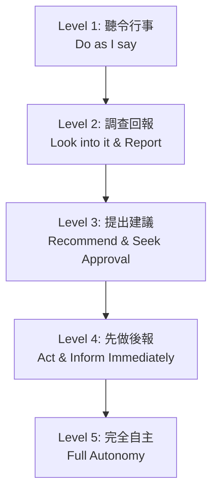

# 授權層級矩陣：破除個人英雄主義與反向授權陷阱

> **標準對齊**：`ICPM: Delegation & Operational Control` | `CMI: Personal Effectiveness & Empowering Others`  
> **核心工具**：J. Richard Hackman 權限層級模型、Delegation of Authority (DoA) 治理邊界

---

## 1. 實戰痛點情境 (The Pain Point Scenario)

!!! danger "典型管理陷阱：猴子跳回背上的『反向授權』"
    **「經理人將專案交辦給下屬，一週後下屬走進辦公室說：『主管，這件事跨部門協調不動，您看該怎麼辦？』主管嘆口氣說：『好吧，放在我桌上，我來處理。』不知不覺中，下屬的任務全部堆回主管身上，主管成了全團隊最大的瓶頸。」**

### 核心病徵診斷
* **二元授權誤區**：誤以為授權只有「完全不管（放任失控）」或「事必躬親（微觀管理）」兩種極端。
* **英雄主義迷思**：主管享受「拯救團隊」的被需要感，反而扼殺了團隊成員的責任感（Accountability）。
* **反向授權（Reverse Delegation）**：未設立防線，任由下屬將問題的思考與決策責任原封不動丟回給主管。

---

## 2. 底層理論解構：授權的 5 大層級模型

卓越的授權不是一刀切，而是根據「任務風險」與「員工成熟度」動態調整的階梯式過程：



### 授權層級矩陣表

| 授權等級 (Level) | 權限範圍 (Scope of Authority) | 決策權歸屬 | 適用情境 (Context) |
| --- | --- | --- | --- |
| **Level 1：聽令行事** | 嚴格按主管指示執行，無決策權 | 主管 100% | 新進員工、危機合規事項、高法律風險任務 |
| **Level 2：調查回報** | 下屬負責收集資訊與列出選項，由主管定奪 | 主管 100% | 複雜但無重大時效性的市場調研、供應商比價 |
| **Level 3：提出建議** | 下屬必須提出「推薦方案與理由」，主管審批 | 主管（下屬主導方案） | 核心業務推進、中等風險之跨部門專案 |
| **Level 4：先做後報** | 下屬可自行決策並執行，但事後必須即時備案 | 下屬 80% / 主管 20% | 具備一定經驗之骨幹、標準預算內的運營調整 |
| **Level 5：完全自主** | 下屬完全自主裁量，僅在定期績效會議中檢視 | 下屬 100% | 資深專家、成熟專案負責人、例行性成熟業務 |

---

## 3. 批判性視角與治理防線

!!! warning "授權不等於棄權 (Delegation is NOT Abdication)"
* **法律與合規責任不可授權**：依據企業治理規範（如 ISO 37000 / 董事會權限表 DoA），經理人可以**授權執行權（Execution Authority）**，但最終責任（Ultimate Accountability）永遠留在主管身上。
* **控制幅度（Span of Control）的局限**：傳統觀點認為一人管 5-7 人最佳；但在敏捷與扁平化組織中，若下屬成熟度高且流程高度標準化，控制幅度可擴大至 15-20 人。

---

## 4. 國際認證考核對齊

=== "ICPM (Certified Manager) 考核視角"
* **核心評估點**：`Management Functions - Organizing & Leading`
* **高頻考點**：如何打破「反向授權」？標準答案是**經理人應扮演教練（Coach），引導下屬思考方案，而非直接接手任務**。

=== "CMI (Chartered Manager) 考核視角"
* **核心評估點**：`Empowering Others & Operational Performance`
* **實務要求**：候選人必須能展示如何透過設定風險邊界與里程碑檢核點（Milestones）來實現結構化賦能。

---

## 5. 實戰工具箱：反向授權防禦話術與 90 天清單

### 化解「反向授權」的三句教練話術

> ❌ **錯誤回應**：「好啦，這件事太急了，放著我來弄。」
> 💡 **話術一（要求方案）**：「在交給我之前，你已經嘗試過哪兩種解決方案？你個人最推薦哪一種？」
> 💡 **話術二（劃定邊界）**：「這件事的授權等級是 Level 3。你需要帶著分析報告和具體建議來找我，而不是帶著問題來找我。」
> 💡 **話術三（賦能支持）**：「你覺得要推動這件事，你需要我幫你調配什麼資源或授權，才能由你親自完成它？」

---

!!! success "新晉主管 90 天漸進式授權清單"
- [ ] **第 1-30 天（盤點邊界）**：梳理目前手中所有事務，列出哪些是屬於「只有我能做」的法定/戰略事項，哪些是可以下放的例行事項。
- [ ] **第 31-60 天（推進至 Level 3）**：針對核心骨幹，強制要求所有請示必須附帶「至少兩種備選方案及優缺點分析」。
- [ ] **第 61-90 天（釋放至 Level 4/5）**：選定 2 項高頻運營任務，設立預算上限與合規紅線後，完全放權給下屬執行。

```
