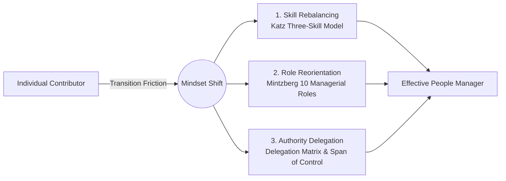

# Module 01 Overview: Transitioning from Top Performer to Manager

> **Module Focus**: Managerial Self-Diagnosis and Mindset Transformation  
> **Aligned Standards**: `CMI: Personal Effectiveness` | `ICPM: Management Foundations`

---

## 1. The Pain Point Scenario

!!! danger "Executive and Boardroom Risk: The Double Loss"
    **"The organization promoted its top sales representative or lead technical specialist to a management role. Three months later, team performance stagnated, direct reports complained about micromanagement, and the new manager worked excessive hours toward burnout."**

In organizational development and change management, this is known as the **Peter Principle trap**: individuals are promoted to their level of incompetence. For the enterprise, this causes a double loss—**losing a top individual contributor while gaining an ineffective and frustrated manager.**

### Root Cause: Path Dependency
Many managers fail to recognize that **"what got you here won't get you there."** They rely on personal execution to gain security and accomplishment, struggling to transition toward achieving results through empowering others.

---

## 2. Theoretical Framework Map

To address this challenge, this module applies three classic management frameworks to guide managers through mindset and behavioral shifts:



* **[Theory 1: Katz Three-Skill Model](katz-skills.en.md)**: Understand why technical expertise diminishes in relative importance while human and conceptual skills become critical.
* **[Theory 2: Mintzberg 10 Managerial Roles](https://www.google.com/search?q=mintzberg-roles.en.md)**: Debunk the myth that managers only issue orders by exploring interpersonal, informational, and decisional roles.
* **[Action Tool: Delegation Level Matrix](https://www.google.com/search?q=delegation-matrix.en.md)**: Establish clear delegation of authority, balance oversight, and set control baselines.

---

## 3. Certification Alignment

=== "CMI (Chartered Manager)"
* **Assessment Focus**: Demonstrating strong **self-awareness**.
* **Practical Expectation**: Managers must identify their leadership blind spots and demonstrate how reflective practice reshapes team engagement.

=== "ICPM (Certified Manager)"
* **Assessment Focus**: Mastering **delegation and time prioritization**.
* **Key Examination Theme**: When facing urgent tasks, the standard response is evaluating team capabilities, delegating with milestone reviews, rather than taking over operational firefighting.

---

## 4. Actionable Toolkit: Managerial Self-Diagnosis

!!! success "Management Transition Self-Checklist"
*Checking 3 or more items indicates a potential micromanagement trap:*

```
- [ ] **Time Misallocation**: Spending over 50% of working hours on operational tasks instead of strategic planning or coaching.
- [ ] **Decision Bottleneck**: Daily operations stall or produce errors if the manager is out of contact for three consecutive days.
- [ ] **Zero Error Tolerance**: Intervening immediately and taking over whenever a direct report uses an unfamiliar approach.
- [ ] **Reverse Delegation**: Direct reports regularly pass unfinished or difficult tasks back up to the manager.
- [ ] **Strategic Blind Spot**: Inability to articulate how current departmental objectives directly support executive board priorities.

```
