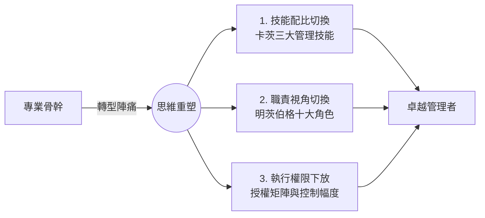

# 模組 01 總覽：從專業骨幹到卓越管理者的轉型陣痛

> **模組定位**：經理人自我診斷與認知重塑  
> **對齊標準**：特許管理學會（CMI）個人效能維度 | 美國專業經理人學會（ICPM）管理基礎範疇

---

## 1. 實戰痛點情境

!!! danger "高階人事與董事會視角的組織隱患：雙重損失"
    **「公司提拔了業績最好的頂尖業務或技術最強的工程師擔任主管。結果三個月後，團隊業績毫無起色，下屬抱怨主管變成控制狂，而這位新主管自己天天加班到深夜，瀕臨崩潰。」**

在組織發展與變革管理的實務中，這被稱為管理層的**「彼得原理陷阱」**：員工往往會被晉升到他們無法勝任的職位。對企業而言，這造成了雙重損失——**失去了一位頂尖的專業骨幹，同時得到了一位平庸甚至有害的管理盲點製造者。**

### 核心病徵：路徑依賴
許多經理人無法意識到，**「讓你在過去成功的技能，往往是阻礙你未來成功的絆腳石」**。他們習慣透過「自己動手解決問題」來獲取成就感與安全感，而無法適應透過「賦能他人來達成目標」。

---

## 2. 模組理論解構地圖

為了解決上述痛點，本模組透過三個經典的管理學與治理框架，協助經理人完成思維模式與行為模式的雙重切換：



* **[理論一：卡茨三大管理技能](katz-skills.zh.md)**：解析為何技術能力不再是核心重點，而人際與概念化技能必須大幅提升。
* **[理論二：明茨伯格十大管理角色](https://www.google.com/search?q=mintzberg-roles.zh.md)**：打破「管理者只是發號施令」的迷思，解構人際、資訊與決策三大範疇的實務角色。
* **[實戰工具：授權層級矩陣](https://www.google.com/search?q=delegation-matrix.zh.md)**：建立清晰的授權邊界，學會抓大放小並設立風險防線。

---

## 3. 國際認證考核對齊

=== "特許管理學會（CMI）標準"
* **考核核心**：要求候選人展現強大的**自我覺察能力**。
* **實務要求**：經理人必須能清晰描述自身的管理風格盲點，以及如何透過反思實踐來調整領導風格與團隊互動方式。

=== "專業經理人學會（ICPM）標準"
* **考核核心**：聚焦於**授權技巧與時間管理**。
* **高頻考點**：面對突發或緊急任務時，優秀經理人的標準行為永遠是「評估團隊能力並合理授權，同時設立檢核點」，而非「親自下場救火」。

---

## 4. 實戰工具箱：課堂與團隊自我診斷清單

!!! success "經理人自我檢核表"
*若您符合以下三項或以上，代表您正深陷微觀管理的轉型危機：*

```
- [ ] **時間錯置**：每天花費超過一半的時間在處理具體的業務執行細節，而不是規劃戰略或輔導團隊。
- [ ] **決策瓶頸**：若主管請假三天且完全不聯絡，團隊的日常業務推進就會停擺或出錯。
- [ ] **零錯誤容忍**：看到下屬做事方法不同，即使不會造成重大損失，也會忍不住中斷對方並親自接手。
- [ ] **反向授權**：下屬遇到困難時，最後往往變成主管替下屬完成工作。
- [ ] **戰略盲區**：無法立刻說明部門當前目標如何直接支持公司董事會的核心戰略與商業價值。

```
