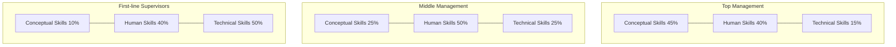

# Overcoming the Transition Bottleneck: Katz Three-Skill Model[cite: 1]

> **Standards Alignment**: `CMI: Personal Effectiveness` | `ICPM: Management Foundations & Roles`[cite: 1]  
> **Core Literature**: Robert L. Katz (1955), *"Skills of an Effective Administrator"*, Harvard Business Review.[cite: 1]

---

## 1. The Pain Point Scenario[cite: 1]

!!! danger "Typical Management Trap: The Burnout of Top Performers"
    **"Before the promotion, they were the top engineer or sales champion. After the promotion, they micromanage everything, believe subordinates are too slow, work overtime until midnight, yet team morale continues to plummet, leading to the resignation of key staff."**[cite: 1]

### Core Symptom Diagnosis[cite: 1]
* **Competency Trap**: The misconception that "the technical expertise that made me successful in the past will continue to make me successful as a manager."[cite: 1]
* **Micromanagement**: Inability to tolerate subordinates' trial-and-error in execution details, thereby depriving the team of growth opportunities.[cite: 1]
* **Strategic Blindness**: Failing to align the team's daily operational work with executive HR and boardroom strategic priorities.[cite: 1]

---

## 2. Theoretical Framework[cite: 1]

Harvard scholar Robert Katz proposed that managerial effectiveness is not dependent on single personality traits, but rather on three core skills that can be developed through practice. Furthermore, the relative importance of these skills shifts structurally as one ascends the management hierarchy:[cite: 1]



### The Three Skill Dimensions


| Skill Dimension | Core Definition | Observable Behaviors |
| --- | --- | --- |
| **Technical Skill** | Proficiency in specific methods, processes, tools, and specialized knowledge. | Coding, financial modeling, drafting legal contracts, operating specialized equipment. |
| **Human / Interpersonal Skill** | The ability to work effectively as a team member and build cooperative effort within the team. | Empathetic listening, cross-departmental negotiation, conflict resolution, coaching. |
| **Conceptual Skill** | The ability to see the enterprise as a whole and understand how various parts depend on one another. | Strategic planning, business model innovation, organizational design, geopolitical risk anticipation. |

---

## 3. Certification Alignment


=== "CMI (Chartered Manager) Perspective"
* **Assessment Domains**: `Personal Effectiveness` & `Leading People`


* **Core Evaluation**: Can the manager transition from "Direct Output" (doing it themselves) to "Output through Others" (empowering the team)?
* **Common Pitfall**: In case studies, candidates often describe how they personally solved a technical problem rather than demonstrating how they empowered the team or facilitated cross-functional collaboration.

=== "ICPM (Certified Manager) Perspective"
* **Assessment Domains**: `Management Skills & Foundations`


* **Core Evaluation**: Accurately identifying the required proportion of the three skills across different organizational levels (First-line, Middle, Top).
* **High-Frequency Exam Focus**: **Human Skills remain consistently critical across ALL levels of management**, whereas Technical and Conceptual skills inversely scale.

---

## 4. Actionable Toolkit


!!! success "New Manager 30-60-90 Day Skill Transition Checklist"
- [ ] **Day 30 (Technical Detachment)**: Have I proactively reduced my hands-on technical / operational tasks to **under 50%** of my weekly hours?
- [ ] **Day 60 (Human Empowerment)**: Have I completed at least two 1-on-1 coaching sessions with every direct report?
- [ ] **Day 90 (Conceptual Alignment)**: Can I clearly articulate to my team in under 3 minutes how our current quarterly goals support the corporate annual strategy?

```
