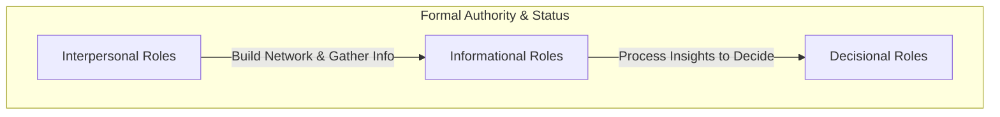

# Mintzberg 10 Managerial Roles: Deconstructing the Reality & Critical Review

> **Standards Alignment**: `CMI: Interpersonal Excellence & Personal Effectiveness` | `ICPM: Management Roles`  
> **Core Literature**: Henry Mintzberg (1973), *"The Nature of Managerial Work"*, Harper & Row.

---

## 1. The Pain Point Scenario

!!! danger "The Executive Dilemma: Fragmentation and Productivity Anxiety"
    **"After stepping into a managerial position, the day is consumed by endless meetings, sudden fires to put out, and unread emails. By evening, a familiar anxiety arises: 'What did I actually achieve today?'"**

### Core Symptom Diagnosis
* **The Classical Myth**: Believing that effective managers spend their days in tranquil, reflective planning, organizing, and controlling.
* **Role Misalignment**: Failing to recognize that crisis management, networking, and liaison duties ARE the core work, leading to severe cognitive fatigue.

---

## 2. Theoretical Framework: 3 Categories and 10 Roles

Mintzberg's observational studies revealed that managerial work is inherently **fragmented, brief, and heavily reliant on oral communication**. He organized managerial behavior into three core categories stemming from formal authority:



### The 10 Managerial Roles Matrix

| Category | Specific Role | Core Function | Observable Example |
| --- | --- | --- | --- |
| **Interpersonal** | **1. Figurehead** | Performing ceremonial and symbolic duties | Attending contract signings, hosting key clients |
|  | **2. Leader** | Motivating, coaching, and aligning team members | Conducting 1-on-1s, setting performance standards |
|  | **3. Liaison** | Developing and maintaining external/internal networks | Informal coffee chats with cross-department peers |
| **Informational** | **4. Monitor** | Scanning internal and external environments | Tracking competitor intelligence, sensing team sentiment |
|  | **5. Disseminator** | Filtering and sharing critical data with subordinates | Cascading board strategy, updating project roadmaps |
|  | **6. Spokesperson** | Representing the unit to external stakeholders | Presenting quarterly results to senior executives |
| **Decisional** | **7. Entrepreneur** | Initiating change and identifying opportunities | Championing digital transformation, piloting initiatives |
|  | **8. Disturbance Handler** | Responding to unexpected crises and bottlenecks | Resolving labor disputes, addressing supply chain shocks |
|  | **9. Resource Allocator** | Deciding where time, budget, and headcount are deployed | Approving project budgets, assigning senior engineers |
|  | **10. Negotiator** | Representing the organization in formal bargaining | Negotiating vendor contracts, cross-team resource sharing |

!!! note "The Operational Challenge of Role Overlap"
Mintzberg acknowledged that the 10 roles are not completely operationalized. In practice, a single managerial action often embodies multiple roles simultaneously—for instance, a 1-on-1 coaching session combines "Leader" (motivation), "Disseminator" (information sharing), and "Monitor" (intelligence gathering). **Managerial excellence lies not in isolating roles, but in dynamic balancing.**

---

## 3. Critical Perspectives & Methodological Review

!!! quote "Mintzberg's Provocative Insight and Later Self-Reflection"
"Management is not a science, nor is it a profession. Management is a craft—it relies on experience, gut feeling, and interpersonal insight, not rigid formulas."

*In later reviews, Mintzberg conceded that his early work remained largely a "taxonomy of roles" rather than a comprehensive, dynamic theory of managerial action.*

### Academic Critiques & Methodological Limitations

* **Methodological Sample Bias**: The model was derived from structured observations of only **5 CEOs of large organizations**, resulting in a tiny, unrepresentative sample.
* **The Middle-Management Vacuum**: It completely omits the unique dynamics of middle managers, such as upward influence (Managing Up) and lateral peer negotiations.
* **Lack of Contextual Contingency (Shapira & Dunbar, 1980)**: The framework assumes universal role weightings, ignoring variations between early-stage startups and mature multinationals.
* **Omission of Strategic Planning**: By focusing purely on observable ad-hoc behavior, the model undervalues deliberate, long-term strategic planning, risking organizational strategic drift.
* **Overemphasis on Observable Behavior (Reed, 1984)**: Focuses strictly on *what* managers do, ignoring unobservable cognitive processes, values, and decision trade-offs.

---

## 4. Certification Alignment

=== "CMI (Chartered Manager) Focus"
* **Assessment Dimension**: `Interpersonal Excellence` — Evaluates how well a manager leverages the **Liaison** and **Resource Allocator** roles rather than acting as a mere task supervisor.
* **Exam Trap**: Underestimating the strategic value of the "Figurehead" and "Liaison" roles as unproductive socializing.

=== "ICPM (Certified Manager) Focus"
* **Assessment Dimension**: `Decisional Roles` — Decisional capabilities represent the highest test of managerial competency.
* **High-Frequency Question**: Differentiating between **Disturbance Handler** (reactive firefighting) and **Entrepreneur** (proactive innovation).

---

## 5. Actionable Toolkit: Managerial Role Audit & Contingency

!!! success "Weekly Managerial Role Audit Checklist"
- [ ] **Information Balance**: Did I spend too much time as a "Disseminator" while neglecting the "Monitor" role (external scanning)?
- [ ] **Reactive vs. Proactive**: Is over 80% of my week hijacked by "Disturbance Handling", leaving zero bandwidth for "Entrepreneurial" initiatives?
- [ ] **Network Leverage**: Did I engage in at least one deliberate "Liaison" interaction outside my direct silo this week?
- [ ] **Contextual Fit**: Does my current role allocation reflect my organization's life-cycle stage (startup/growth/turnaround) rather than mere habit?

```
