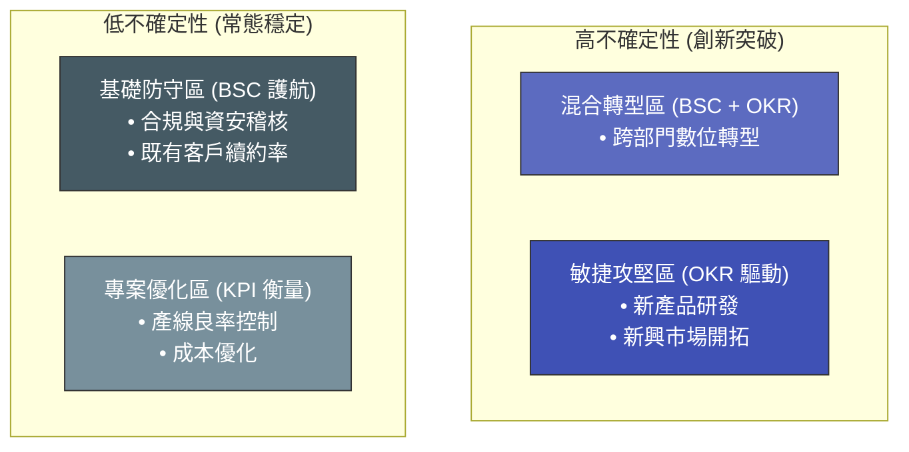

# BSC 與 OKR 整合矩陣：從防守到敏捷的雙軌衡量

> **標準對齊**：`CMI: Managing Performance` | `ICPM: The Controlling Function`  
> **核心文獻**：Robert Kaplan & David Norton (1992), *"The Balanced Scorecard"* | John Doerr (2018), *"Measure What Matters"*

---

## 1. 實戰痛點情境

!!! danger "組織變革危機：水土不服的敏捷框架"
    **「公司過去十年穩定運行 BSC（平衡計分卡），各部門營運井然有序，但缺乏創新。新任管理層為了推動變革，全面廢除 BSC 並導入 OKR。結果第一季結束後，團隊全神貫注於達成具備挑戰性的 OKR，卻導致日常基礎維運（如合規稽核、常態客戶維護）停擺。變革不僅沒有帶來倍數成長，反而動搖了企業的基本盤。」**

### 核心病徵診斷
* **工具排他性迷思**：誤以為最新的管理框架一定能完全取代舊有框架，忽略了組織變革中的路徑依賴。
* **守成與創新的失衡**：BSC 擅長衡量「防守與穩定（Business as Usual, BAU）」，而 OKR 擅長驅動「進攻與突破」。單一依賴其中一種，都會導致嚴重的營運盲區。

---

## 2. 理論解構：BSC 與 OKR 的底層邏輯差異

| 比較維度 | 平衡計分卡 (BSC) | 目標與關鍵結果 (OKR) |
| :--- | :--- | :--- |
| **核心哲學** | 結構化、全面性、防禦性 | 敏捷性、聚焦性、進攻性 |
| **涵蓋範圍** | 360 度無死角（財務、客戶、內部流程、學習與成長） | 極度聚焦（每季僅挑選 3-5 個最具突破性的戰場） |
| **節奏與週期** | 年度規劃，由上而下逐層拆解，變動成本高 | 季度迭代，由下而上或水平對齊，容錯率高 |
| **與薪酬關聯** | 強關聯（達標率直接決定年終獎金） | 弱關聯（鼓勵設定 70% 達標即算成功的挑戰性目標） |

---

## 3. 雙軌整合矩陣 (Dual-Track Matrix)

在大型跨部門營運中，最穩健的做法是**「以 BSC 護航，以 OKR 攻堅」**。

---

## 4. 國際認證考核對齊

=== "特許管理學會 (CMI) 考核視角"
* **核心評估點**：`Driving Innovation and Change`
* **實務要求**：經理人需展現出在導入新管理工具時的「變革管理」能力。必須能識別哪些業務流程需要 BSC 的穩定性，哪些跨職能專案需要 OKR 的驅動力。

=== "專業經理人學會 (ICPM) 考核視角"
* **核心評估點**：`Control Systems and Metrics`
* **高頻考點**：理解「前置指標 (Leading Indicators)」與「落後指標 (Lagging Indicators)」的差異。BSC 的財務維度多為落後指標，而 OKR 的關鍵結果應側重於可操作的前置指標。

---

## 5. 實戰工具箱：雙軌制健康度診斷

!!! success "經理人衡量框架檢核表"
- [ ] **基礎健康**：我們是否保留了核心的 BSC/KPI 來監控合規、資安與基礎財務底線，避免在追求 OKR 的過程中引發災難性風險？
- [ ] **薪酬脫鉤**：我們是否明確告訴團隊，OKR 的失敗不會直接導致底薪或常態獎金的扣減，以保護創新的心理安全感？
- [ ] **聚焦度**：本季的 OKR 是否被嚴格控制在 3 個 Objectives 以內？（若超過，代表你只是把 BSC 換個名字繼續做微觀管理）

