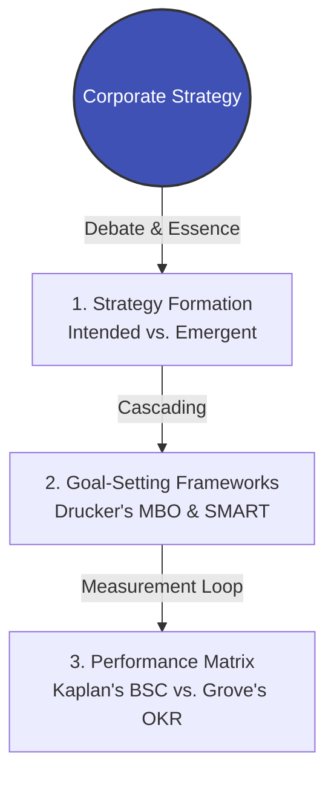

title: Module 02 Overview - Strategy Alignment & Goal Setting
description: Explore the conflict between intended and emergent strategies, resolving the disconnect between board-level planning and frontline execution.
keywords: [Strategy Alignment, Emergent Strategy, MBO, BSC, OKR, CMI Strategic Leadership, ICPM Planning]
---

# Module 02 Overview: Strategy Alignment & Goal Setting

> **Module Focus**: Bridging the Gap Between Boardroom Strategy and Frontline Execution  
> **Aligned Standards**: `CMI: Strategic Management & Leadership` | `ICPM: Planning and Organizing`

---

## 1. The Pain Point Scenario

!!! danger "The Boardroom Trap: Strategy Vacuum and KPI Gaming"
    **"Every year-end, the board and C-suite lock themselves in a room to draft a grand '5-Year Strategic Plan'. Three months later, departments are back to business as usual, cross-functional meetings devolve into arguments over protecting KPIs, and frontline staff have zero visibility into the company's direction. The executives feel ignored, and the staff feel the executives are out of touch."**

### Core Symptom Diagnosis
* **The Strategy Waterfall Fallacy**: The misguided belief that simply cascading high-level goals downward (Top-Down) guarantees execution.
* **Intention vs. Reality**: When external markets shift abruptly, middle managers rigidly cling to obsolete annual KPIs out of fear, causing the organization to miss emerging opportunities.
* **Siloed Metrics**: Departments optimize for their own targets at the expense of the organization (e.g., Sales aggressively promising customizations to hit revenue targets, while R&D refuses to support them to maintain standardization metrics).

---

## 2. Theoretical Framework Map

To break the deadlock of strategy execution, this module guides managers through a three-tier architecture—from "decoding strategy" to "deconstructing goals," and finally to "measuring performance":



* **[Theory 1: Intended vs. Emergent Strategy](https://www.google.com/search?q=%23)**: Deconstruct the master debate between Michael Porter (Design School) and Henry Mintzberg (Learning School) to understand why frontline improvisation is as critical as board-level planning.
* **[Theory 2: MBO and SMART Criteria](https://www.google.com/search?q=%23)**: Explore Peter Drucker's original human-centric intent for Management by Objectives (MBO), and analyze how it often degrades into a micromanagement tool.
* **[Action Tool: The BSC & OKR Integration Matrix](https://www.google.com/search?q=%23)**: Resolve the perceived conflict between the Balanced Scorecard (BSC) and Objectives & Key Results (OKR), building a hybrid measurement system tailored to organizational maturity.

---

## 3. Certification Alignment

=== "CMI (Chartered Manager) Perspective"
* **Assessment Dimension**: `Strategic Management and Leadership`
* **Core Evaluation**: Can the manager translate an abstract organizational Vision into concrete, communicable, and ethically sound departmental action plans while remaining agile to macro-environmental (PESTLE) shifts?

=== "ICPM (Certified Manager) Perspective"
* **Assessment Dimension**: `Planning and Organizing`
* **High-Frequency Exam Focus**: Distinguishing the boundaries between "Strategic Planning" (Top management/Long-term) and "Operational Planning" (Middle & First-line/Short-term), and proficiently applying SMART criteria to audit subordinate goals.

---

## 4. Actionable Toolkit: Strategic Alignment Audit

!!! success "Manager's 360-Degree Alignment Checklist"
*Honestly evaluate your current department against the following:*

```
- [ ] **Vertical Alignment**: Can my department's top 3 KPIs be directly traced back to support the CEO's two primary strategic objectives for the year?
- [ ] **Horizontal Alignment**: Does achieving my department's goals inadvertently cause resource cannibalization or penalize other collaborating departments (e.g., my zero-defect goal causing Procurement to exceed their budget)?
- [ ] **Bottom-up Emergence**: In the past 6 months, have I actively petitioned upper management to alter our set plans based on an unexpected market opportunity discovered by my frontline staff?
- [ ] **Meaningful Metrics**: Do team members clearly understand what specific value their daily work creates for the customer or society, beyond just "hitting numbers for a bonus"?

```
