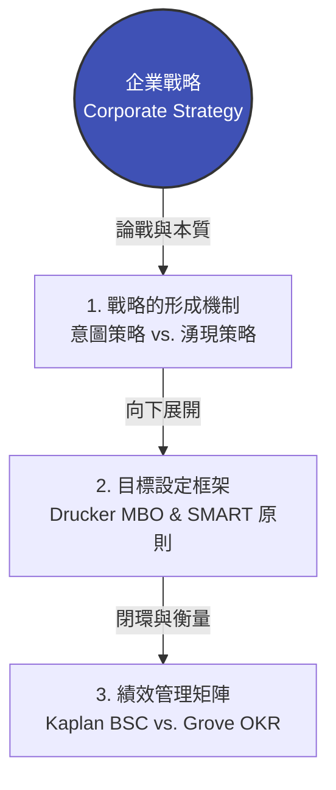
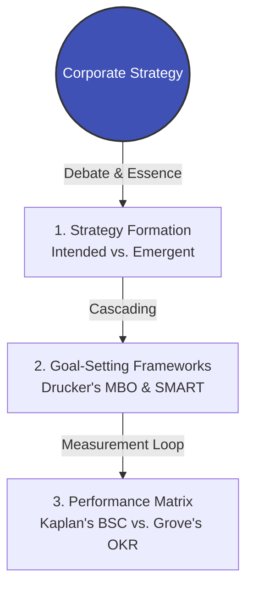

# 模組 02 總覽：策略解構與目標對齊

> **模組定位**：弭平董事會戰略與基層執行的斷層  
> **對齊標準**：特許管理學會（CMI）戰略領導力維度 | 美國專業經理人學會（ICPM）規劃與組織職能

---

## 1. 實戰痛點情境

!!! danger "高階治理陷阱：戰略真空與 KPI 遊戲化"
    **「每年年底，董事會與高管團隊在閉門會議中制定了宏大的『五年戰略規劃』。但三個月後，各部門依然在做原來的事，跨部門會議只關心如何美化 KPI 數字，基層員工對公司的戰略方向一無所知，甚至覺得高層的決策『不接地氣』。」**

### 核心病徵診斷
* **戰略瀑布失效**：誤以為只要把高層的目標按比例拆解給下屬（Top-Down），戰略就會自然實現。
* **意圖與現實的衝突**：當外部市場發生劇變時，中層主管不敢偏離年初設定的僵化 KPI，導致錯失前線機會。
* **孤島式指標**：各部門為了達成各自的指標而互相掣肘（例如：業務部為了營收拚命接客製化訂單，研發部為了標準化指標拒絕配合）。

---

## 2. 模組理論解構地圖

為了破解「戰略無法落地」的死局，本模組將透過三層架構，引導經理人從「看懂戰略」到「拆解目標」，最後「衡量績效」：



* **[理論一：意圖策略 vs. 湧現策略 (Intended vs. Emergent Strategy)](https://www.google.com/search?q=%23)**：解構 Michael Porter（計畫學派）與 Henry Mintzberg（實踐學派）的大師交鋒，理解前線變通為何與高層規劃同等重要。
* **[理論二：MBO 目標管理與 SMART 原則](https://www.google.com/search?q=%23)**：探討彼得·德魯克提出 MBO 的人本初衷，以及它如何在現代企業中被異化為微觀管理工具。
* **[實戰工具：BSC 與 OKR 整合矩陣](https://www.google.com/search?q=%23)**：破解「平衡計分卡」與「目標與關鍵結果」的水火不容，建立適用於不同組織發展階段的混合衡量系統。

---

## 3. 國際認證考核對齊

=== "特許管理學會（CMI）視角"
* **考核維度**：`Strategic Management and Leadership`
* **核心評估點**：經理人能否將抽象的組織願景（Vision）轉化為具體、可溝通且具備商業倫理的部門行動計畫，並能動態應對外部環境變化（PESTLE 因素）。

=== "專業經理人學會（ICPM）視角"
* **考核維度**：`Planning and Organizing`
* **高頻考點**：區分「戰略規劃（Strategic Planning - 高階/長期）」與「營運規劃（Operational Planning - 中基層/短期）」的權責邊界，並熟練運用 SMART 原則審核下屬目標。

---

## 4. 實戰工具箱：部門戰略對齊度診斷清單

!!! success "經理人 360 度戰略對齊檢核"
*請針對您領導的部門，誠實勾選以下狀態：*

```
- [ ] **垂直對齊 (Vertical Alignment)**：我部門的三個核心 KPI，是否能直接追溯並支持 CEO 剛發布的年度兩大戰略目標？
- [ ] **水平對齊 (Horizontal Alignment)**：我部門的目標達成，是否會對其他協作部門造成資源排擠或考核懲罰（例如：我的良率目標導致採購部成本超標）？
- [ ] **前線回饋 (Bottom-up Emergence)**：過去六個月內，我是否曾因為前線員工發現的新市場機會，而主動向上級申請修改年初設定的既定計畫？
- [ ] **指標意義 (Meaningful Metrics)**：團隊成員是否清楚知道，除了「達標拿獎金」之外，他們的日常工作對客戶或社會創造了什麼具體價值？

```

```

---

### 2. 純英文版：`docs/02-strategy-alignment/index.en.md`

```markdown
---
title: Module 02 Overview - Strategy Alignment & Goal Setting
description: Explore the conflict between intended and emergent strategies, resolving the disconnect between board-level planning and frontline execution.
keywords: [Strategy Alignment, Emergent Strategy, MBO, BSC, OKR, CMI Strategic Leadership, ICPM Planning]
---

# Module 02 Overview: Strategy Alignment & Goal Setting

> **Module Focus**: Bridging the Gap Between Boardroom Strategy and Frontline Execution  
> **Aligned Standards**: `CMI: Strategic Management & Leadership` | `ICPM: Planning and Organizing`

---

## 1. The Pain Point Scenario

!!! danger "The Boardroom Trap: Strategy Vacuum and KPI Gaming"
    **"Every year-end, the board and C-suite lock themselves in a room to draft a grand '5-Year Strategic Plan'. Three months later, departments are back to business as usual, cross-functional meetings devolve into arguments over protecting KPIs, and frontline staff have zero visibility into the company's direction. The executives feel ignored, and the staff feel the executives are out of touch."**

### Core Symptom Diagnosis
* **The Strategy Waterfall Fallacy**: The misguided belief that simply cascading high-level goals downward (Top-Down) guarantees execution.
* **Intention vs. Reality**: When external markets shift abruptly, middle managers rigidly cling to obsolete annual KPIs out of fear, causing the organization to miss emerging opportunities.
* **Siloed Metrics**: Departments optimize for their own targets at the expense of the organization (e.g., Sales aggressively promising customizations to hit revenue targets, while R&D refuses to support them to maintain standardization metrics).

---

## 2. Theoretical Framework Map

To break the deadlock of strategy execution, this module guides managers through a three-tier architecture—from "decoding strategy" to "deconstructing goals," and finally to "measuring performance":



* **[Theory 1: Intended vs. Emergent Strategy](https://www.google.com/search?q=%23)**: Deconstruct the master debate between Michael Porter (Design School) and Henry Mintzberg (Learning School) to understand why frontline improvisation is as critical as board-level planning.
* **[Theory 2: MBO and SMART Criteria](https://www.google.com/search?q=%23)**: Explore Peter Drucker's original human-centric intent for Management by Objectives (MBO), and analyze how it often degrades into a micromanagement tool.
* **[Action Tool: The BSC & OKR Integration Matrix](https://www.google.com/search?q=%23)**: Resolve the perceived conflict between the Balanced Scorecard (BSC) and Objectives & Key Results (OKR), building a hybrid measurement system tailored to organizational maturity.

---

## 3. Certification Alignment

=== "CMI (Chartered Manager) Perspective"
* **Assessment Dimension**: `Strategic Management and Leadership`
* **Core Evaluation**: Can the manager translate an abstract organizational Vision into concrete, communicable, and ethically sound departmental action plans while remaining agile to macro-environmental (PESTLE) shifts?

=== "ICPM (Certified Manager) Perspective"
* **Assessment Dimension**: `Planning and Organizing`
* **High-Frequency Exam Focus**: Distinguishing the boundaries between "Strategic Planning" (Top management/Long-term) and "Operational Planning" (Middle & First-line/Short-term), and proficiently applying SMART criteria to audit subordinate goals.

---

## 4. Actionable Toolkit: Strategic Alignment Audit

!!! success "Manager's 360-Degree Alignment Checklist"
*Honestly evaluate your current department against the following:*

```
- [ ] **Vertical Alignment**: Can my department's top 3 KPIs be directly traced back to support the CEO's two primary strategic objectives for the year?
- [ ] **Horizontal Alignment**: Does achieving my department's goals inadvertently cause resource cannibalization or penalize other collaborating departments (e.g., my zero-defect goal causing Procurement to exceed their budget)?
- [ ] **Bottom-up Emergence**: In the past 6 months, have I actively petitioned upper management to alter our set plans based on an unexpected market opportunity discovered by my frontline staff?
- [ ] **Meaningful Metrics**: Do team members clearly understand what specific value their daily work creates for the customer or society, beyond just "hitting numbers for a bonus"?

```

```

**Next Step:** When you are ready, we will dive into the first core theory file of this module: **Michael Porter vs. Henry Mintzberg (Intended vs. Emergent Strategy)**.

```
