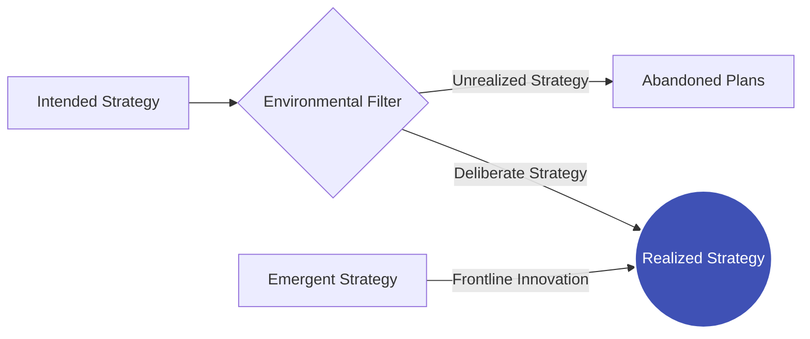

# Intended vs. Emergent Strategy: Resolving the Boardroom-Frontline Conflict

> **Standards Alignment**: `CMI: Strategic Agility & Change` | `ICPM: Planning and Decision Making`  
> **Core Literature**: Henry Mintzberg (1985), *"Of Strategies, Deliberate and Emergent"*, Strategic Management Journal.

---

## 1. The Pain Point Scenario

!!! danger "Executive Crisis: The Fear of Missing Out (FOMO) Trapped by Perfect Plans"
    **"At the start of the year, the board spent three months with top consultants drafting a flawless '5-Year Digital Transformation Strategy' (Intended Strategy). By mid-year, Generative AI exploded, and frontline engineers discovered highly disruptive new applications. However, middle management strictly forbade deviating from the plan to ensure 'Year-End KPI Achievement.' Ultimately, the company executed the plan perfectly but completely lost the market."**

### Core Symptom Diagnosis
* **Strategic Hubris**: The misconception that executives in a closed boardroom can perfectly predict market trajectories three years in advance.
* **Equating "Inflexibility" with "Loyalty"**: In rigid bureaucracies, deviating from the set strategy is viewed as insubordination, suffocating frontline innovation and market responsiveness.

---

## 2. Theoretical Framework: Mintzberg’s Strategy Evolution

Henry Mintzberg heavily criticized the traditional "Design School" of strategic management, asserting: **Real-world strategy is never a perfect linear execution; it evolves through the collision between planning and reality.**



* **Intended Strategy**: The original blueprint conceived by top management.
* **Unrealized Strategy**: Plans that fail due to market shifts or execution gaps (often a high percentage).
* **Emergent Strategy**: Unplanned actions that naturally arise from frontline practice, prove effective, and are eventually adopted by the organization.
* **Realized Strategy**: The actual path the organization ends up taking (a blend of deliberate execution and emergent adaptation).

---

## 3. Critical Perspectives: The Master Debate

This is not merely about definitions; it represents the most famous debate in strategic management history—**The Design School vs. The Learning School**:

| Dimension | Michael Porter (Design / Intended) | Henry Mintzberg (Learning / Emergent) |
| --- | --- | --- |
| **Core Philosophy** | Strategy is **analyzed and designed Top-Down**. | Strategy is **learned and crafted Bottom-Up** through practice. |
| **Analytical Tools** | Five Forces, Value Chain, Generic Strategies. | Management by walking around, frontline empowerment, trial-and-error. |
| **View on Execution** | Thinking and acting are separate (Executives think, subordinates execute). | Thinking and acting are unified (Strategy is shaped during execution). |
| **Fatal Blind Spot** | Prone to "Analysis Paralysis" in highly volatile (VUCA) environments. | Risks "Strategic Drift" (chaos) if not synthesized by executive vision. |

---

## 4. Certification Alignment

=== "CMI (Chartered Manager) Perspective"
* **Assessment Dimension**: `Strategic Agility & Change`
* **Practical Expectation**: Managers must demonstrate the ability to strike a dynamic balance between aligning the team with corporate intent and empowering the frontline to capture emergent opportunities.

=== "ICPM (Certified Manager) Perspective"
* **Assessment Dimension**: Application of `Environmental Scanning`.
* **High-Frequency Exam Focus**: Emergent strategies often stem from weak market signals detected by frontline staff. Managers must establish robust "upward communication channels" to prevent critical intelligence from being filtered out by the bureaucracy.

---

## 5. Actionable Toolkit: Strategic Agility Audit

!!! success "Manager's Quarterly Strategy Reflection"
- [ ] **Blind Spot Detection**: What original plans did we abandon this quarter (Unrealized)? Was it due to poor execution, or did the market fundamentally change?
- [ ] **Capturing Emergence**: Has the frontline team discovered any new approaches that aren't in the annual KPIs but offer immense customer value? Have I escalated these to secure executive sponsorship?
- [ ] **Empowerment Boundaries**: Do I protect at least 15% "bandwidth for innovation and trial-and-error" for my team to experiment outside the strict intended strategy?

```
