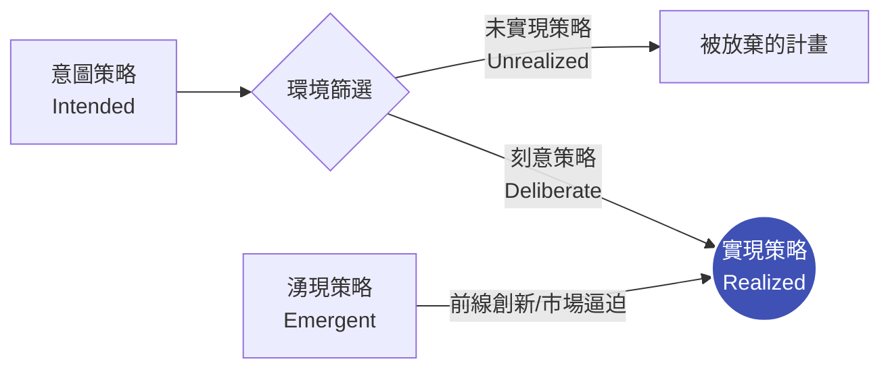

# 意圖策略 vs. 湧現策略：破解高層規劃與前線現實的衝突

> **標準對齊**：`CMI: Strategic Agility & Change` | `ICPM: Planning and Decision Making`  
> **核心文獻**：Henry Mintzberg (1985), *"Of Strategies, Deliberate and Emergent"*, Strategic Management Journal.

---

## 1. 實戰痛點情境

!!! danger "高階治理危機：被完美計畫綁架的錯失恐懼 (FOMO)"
    **「年初，董事會花了三個月聘請頂級管顧，制定了完美無缺的『五年數位轉型戰略（意圖策略）』。年中時，生成式 AI 突然爆發，前線工程師發現了更具顛覆性的應用模式；但中層主管為了確保『年底 KPI 達標』，嚴格禁止團隊偏離原定計畫。最終，公司完美執行了計畫，卻徹底失去了市場。」**

### 核心病徵診斷
* **戰略傲慢 (Strategic Hubris)**：誤以為高階主管能在封閉的會議室裡，完美預測未來三年的市場走向。
* **將「不變」視為「忠誠」**：在僵化的科層組織中，偏離既定戰略被視為「抗命」，扼殺了前線的創新與市場敏感度。

---

## 2. 底層理論解構：Mintzberg 的戰略演化模型

明茨伯格（Mintzberg）強烈批判傳統的「計畫學派」，他指出：**真實世界的戰略，從來不是完美的直線執行，而是在計畫與現實的碰撞中演化出來的。**

* **意圖策略 (Intended Strategy)**：高層最初構想的藍圖。
* **未實現策略 (Unrealized Strategy)**：因市場變化或執行力不足而失敗的計畫（通常佔比極高）。
* **湧現策略 (Emergent Strategy)**：沒有事先計畫，但在前線實踐中自然產生、被證明有效並最終被組織採納的行動模式。
* **實現策略 (Realized Strategy)**：企業最終真正走出來的路（刻意策略與湧現策略的混合體）。

---

## 3. 批判性視角：大師的世紀交鋒

這不僅是名詞解釋，更是戰略管理史上最著名的論戰——**設計學派（Design School） vs. 學習學派（Learning School）**：

| 比較維度 | Michael Porter (波特 / 意圖策略派) | Henry Mintzberg (明茨伯格 / 湧現策略派) |
| --- | --- | --- |
| **核心哲學** | 戰略是**由上而下（Top-down）分析與設計**出來的 | 戰略是**由下而上（Bottom-up）學習與實踐**出來的 |
| **分析工具** | 五力模型、價值鏈、通用戰略 | 走動式管理、前線授權、試錯文化 |
| **對執行的看法** | 思考與行動是分離的（高層思考，基層執行） | 思考與行動是統一的（在執行中形塑戰略） |
| **致命盲點** | 在快速變動（VUCA）環境中容易陷入「分析癱瘓」 | 若缺乏高層願景收斂，容易淪為「戰略漂移（失控）」 |

---

## 4. 國際認證考核對齊

=== "特許管理學會 (CMI) 考核視角"
* **核心評估點**：評估候選人是否具備 `Strategic Agility`（戰略敏捷性）。
* **實務要求**：經理人必須證明自己能在「確保團隊對齊組織大方向（意圖）」與「授權前線捕捉新機會（湧現）」之間取得動態平衡。

=== "專業經理人學會 (ICPM) 考核視角"
* **核心評估點**：`Environmental Scanning`（環境掃描）的應用。
* **高頻考點**：湧現策略往往來自於基層員工對微弱市場訊號的捕捉，經理人必須建立有效的「向上溝通機制」，防止重要情報被科層體系過濾。

---

## 5. 實戰工具箱：戰略敏捷度檢核表

!!! success "經理人季度戰略反思清單"
- [ ] **盲區偵測**：過去一個季度，我們放棄了哪些原定計畫（Unrealized）？放棄的原因是因為執行不力，還是市場已經改變？
- [ ] **湧現捕捉**：前線團隊是否發掘了任何不在年度 KPI 內，但對客戶極具價值的新做法？我是否將其匯報給高層並申請資源？
- [ ] **授權邊界**：我是否為團隊保留了至少 15% 的「容錯與創新空間」，讓他們能在意圖策略的框架外進行實驗？

