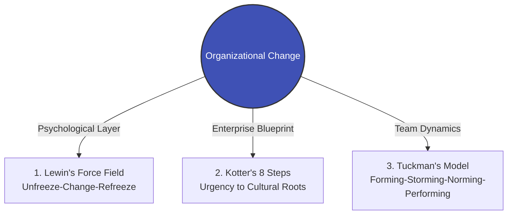

# Module 03 Overview: Change Management & Organizational Resilience

> **Module Focus**: Navigating the deep waters of executive mandates and frontline resistance.  
> **Aligned Standards**: `CMI: Leading and Managing Change` | `ICPM: Leading and Directing`

---

## 1. The Pain Point Scenario

!!! danger "The Boardroom Trap: Performative Change and Silent Resistance"
    **"The board aggressively launched a digital transformation and a new AI governance framework, investing heavily in system upgrades and training. However, six months post-launch, departments still secretly rely on legacy processes, and turnover has spiked. In cross-functional meetings, managers express superficial support while privately blaming the new system for increased workloads. The executive vision has devolved into mere performative compliance."**

### Core Symptom Diagnosis
* **Underestimating the "Unfreezing" Cost**: Mandating change purely through administrative policy without addressing employees' fear of the unknown or perceived loss of status.
* **Storming Phase Attrition**: Cross-functional project teams launch without clear boundaries or conflict resolution mechanisms, causing resources to bleed out in internal politics.
* **Failure to "Refreeze"**: After achieving initial quick wins, the organization fails to hardwire the new behaviors into HR appraisals, promotion criteria, and corporate policies, allowing teams to quickly revert to their comfort zones.

---

## 2. Theoretical Framework Map

This module provides an enterprise-grade navigation path through three layers: psychological defense, organizational rollout, and team dynamics:



* **[Theory 1: Lewin's Change Management & Force Field Analysis](https://www.google.com/search?q=%23)**: Understand why reducing resisting forces (e.g., alleviating employee anxiety) is often more effective than simply increasing driving forces (e.g., dangling larger bonuses).
* **[Theory 2: Kotter’s 8-Step Change Model](https://www.google.com/search?q=%23)**: Deconstruct how large enterprises successfully lead change, avoiding fatal missteps like failing to build a guiding coalition or not generating short-term wins.
* **[Theory 3: Tuckman’s Stages of Team Development](https://www.google.com/search?q=%23)**: Provide a scientific lens for HRBPs and project leaders to accelerate cross-functional teams through the inevitable friction of the "Storming" phase.

---

## 3. Certification Alignment

=== "CMI (Chartered Manager) Perspective"
* **Assessment Dimension**: `Leading and Managing Change`
* **Core Evaluation**: Can the manager identify the psychological impact of change across various stakeholder levels and devise communication strategies that ensure sustainable transformation?

=== "ICPM (Certified Manager) Perspective"
* **Assessment Dimension**: `Leading and Directing`
* **High-Frequency Exam Focus**: Evaluating the shift in leadership styles across different phases of change. For example, utilizing transformational leadership during the "Unfreezing" phase versus relying on structural and policy design during the "Refreezing" phase.

---

## 4. Actionable Toolkit: Change Resilience Audit

!!! success "Manager & HRBP Change Readiness Checklist"
*Before initiating the next organizational restructuring or system rollout, verify the following:*

```
- [ ] **Force Field Audit**: Have we accurately mapped the top 3 resisting forces (e.g., fear of skill obsolescence, increased overtime) and implemented strategies to neutralize them?
- [ ] **Guiding Coalition**: Does the core team driving the change include informal influencers and key opinion leaders, rather than just C-suite executives?
- [ ] **Storming Readiness**: Is there a clear "conflict escalation and resolution mechanism" for the cross-functional team to prevent communication breakdowns?
- [ ] **Refreezing Policies**: Have the new working methods been formally integrated into compensation structures, performance reviews, and corporate governance policies?

