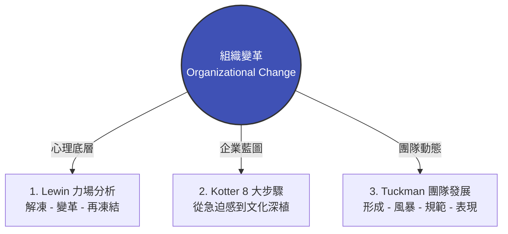

# 模組 03 總覽：變革管理與組織韌性

> **模組定位**：破解高層推動新制與中基層消極抵制的深水區  
> **對齊標準**：特許管理學會（CMI）引領變革 | 美國專業經理人學會（ICPM）領導與指揮職能

---

## 1. 實戰痛點情境

!!! danger "高階治理陷阱：形式主義的變革與沉默的抗拒"
    **「董事會大舉推動數位轉型與全新 AI 治理架構，投入大量資源進行系統升級與教育訓練。然而，政策頒布半年後，各部門依然私下使用舊有流程，甚至出現員工離職潮。跨部門會議中，主管們表面支持，私下卻互相指責新系統增加工作負擔。高層的變革藍圖，最終淪為徒具形式的合規文件。」**

### 核心病徵診斷
* **低估解凍成本**：未處理員工對未知的恐懼與舊有利益的剝奪感，單憑一紙行政命令強推變革。
* **風暴期內耗**：跨職能專案團隊在啟動初期，缺乏清晰的權責邊界與衝突解決機制，導致資源在內部政治中消耗殆盡。
* **缺乏制度再凍結**：變革取得初期成效後，未能及時將新行為寫入 HR 考核、晉升標準與企業政策中，導致團隊迅速退回舒適圈。

---

## 2. 模組理論解構地圖

本模組將從「心理防禦」、「組織推行」到「團隊融合」三個層次，提供企業級的變革導航：



* **[理論一：Lewin 變革模型與力場分析](https://www.google.com/search?q=%23)**：透視驅動力與阻力的角力，理解為何降低阻力（如化解員工焦慮）往往比增加推力（如加碼獎金）更有效。
* **[理論二：Kotter 八步變革模型](https://www.google.com/search?q=%23)**：拆解大型企業如何有效引領變革，避免在「建立強大領導聯盟」與「創造短期勝利」等關鍵節點上翻車。
* **[理論三：Tuckman 團隊發展階段](https://www.google.com/search?q=%23)**：為 HRBP 與專案負責人提供衝突管理的科學視角，加速跨部門團隊度過「風暴期（Storming）」。

---

## 3. 國際認證考核對齊

=== "特許管理學會（CMI）視角"
* **考核維度**：`Leading and Managing Change`
* **核心評估點**：經理人能否辨識變革對組織不同層級利益相關者（Stakeholders）的心理衝擊，並制定相應的溝通與緩解策略，確保變革的可持續性。

=== "專業經理人學會（ICPM）視角"
* **考核維度**：`Leading and Directing`
* **高頻考點**：評估管理者在變革不同階段的領導風格轉換。例如，在解凍期需要願景驅動（Transformational），而在再凍結期則需依賴政策與制度設計。

---

## 4. 實戰工具箱：變革韌性診斷清單

!!! success "經理人與 HRBP 的變革檢核"
*在啟動下一階段組織重組或系統導入前，請確認以下項目：*

```
- [ ] **力場盤點 (Force Field)**：是否已精準列出阻礙變革的 3 大核心阻力（例如：擔心技能淘汰、增加額外工時），並制定了消除阻力的對策？
- [ ] **領導聯盟 (Guiding Coalition)**：推動變革的核心小組中，是否包含了具備非正式影響力的意見領袖，而不僅僅是高階主管？
- [ ] **風暴期準備 (Storming Readiness)**：是否已經為跨部門團隊建立了明確的「衝突升級與解決機制」，防止溝通淪為互相推諉？
- [ ] **制度固化 (Refreezing)**：新的工作模式是否已經與薪酬、績效考核或治理政策（Policy）正式掛鉤？

