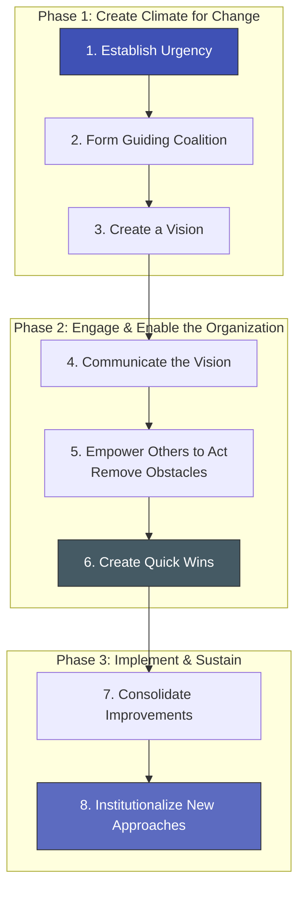

# Kotter's 8-Step Change Model: Blueprint for Enterprise Transformation

> **Standards Alignment**: `CMI: Strategic Leadership & Change` | `ICPM: Planning and Organizing`  
> **Core Literature**: John P. Kotter (1995), *"Leading Change: Why Transformation Efforts Fail"*, Harvard Business Review.

---

## 1. The Pain Point Scenario

!!! danger "Executive Crisis: The Change that Stopped at the Kickoff"
    **"To comply with a new, complex governance standard (e.g., ISO 42001 for AI), the company hosted a massive 'Transformation Kickoff Townhall,' complete with an inspiring speech from the CEO. Three months later, the initiative is completely stalled. Legal blames IT for non-compliance, while Sales argues the new workflows destroy revenue. Lacking a powerful guiding coalition and visible early results, the executive vision has dissolved into an empty mandate."**

### Core Symptom Diagnosis
* **Confusing "Announcements" with "Change"**: The dangerous assumption that publishing a policy or hosting a meeting automatically alters human behavior, ignoring the need for a systemic, step-by-step rollout.
* **The Absence of Quick Wins**: Large-scale cross-functional transformations often take years. If teams don't see indisputable, positive results within the first few months, momentum dies, and executive patience evaporates.

---

## 2. Theory Deconstruction: Kotter's 3 Phases and 8 Steps

Based on studying over 100 failed corporate transformations, Harvard Business School Professor John Kotter identified 8 sequential steps crucial for success, grouped into three main phases:

### Critical Minefield Analysis

* **The Step 2 Trap (Guiding Coalition)**: The coalition cannot consist solely of C-suite executives. It must include individuals with cross-functional networks, deep technical expertise, and informal influence (Key Opinion Leaders).
* **The Step 5 Blind Spot (Removing Obstacles)**: If the company's legacy KPI and compensation systems continue to reward old behaviors, no amount of visionary communication will work. Removing structural and HR barriers is the core duty of management in this phase.

---

## 3. Certification Alignment

=== "CMI (Chartered Manager) Perspective"
* **Assessment Dimension**: `Stakeholder Management in Change`
* **Practical Expectation**: Managers must demonstrate how to manage stakeholder expectations effectively through Step 4 (Communication) and Step 6 (Quick Wins), converting skeptics into active supporters.

=== "ICPM (Certified Manager) Perspective"
* **Assessment Dimension**: `Organizing Resources for Strategic Goals`
* **High-Frequency Exam Focus**: The absolute sequence of the steps. Skipping "Urgency" to jump straight into "Removing Obstacles" creates confusion; failing to "Institutionalize" at the end guarantees a regression to the status quo.

---

## 4. Actionable Toolkit: Change Kickoff Audit

!!! success "Manager's First 90 Days Checklist"
- [ ] **The Urgency Test**: Do at least 75% of the core management team genuinely believe that "the risk of maintaining the status quo outweighs the pain of changing"?
- [ ] **Coalition Power Structure**: Does our guiding coalition possess enough formal authority to reallocate budgets, and enough informal credibility to overcome departmental resistance?
- [ ] **Low-hanging Fruit**: Have we engineered a specific, indisputable "Quick Win" that can be celebrated company-wide by day 30 of the project?
