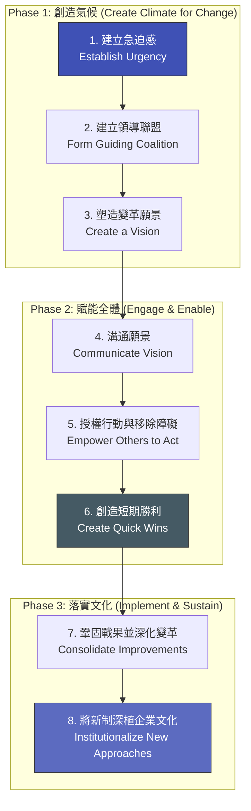

# Kotter 八大變革步驟：打造企業級變革藍圖

> **標準對齊**：`CMI: Strategic Leadership & Change` | `ICPM: Planning and Organizing`  
> **核心文獻**：John P. Kotter (1995), *"Leading Change: Why Transformation Efforts Fail"*, Harvard Business Review.

---

## 1. 實戰痛點情境

!!! danger "高階治理危機：只停留在啟動大會的變革"
    **「公司為了應對全新的 AI 治理合規標準（如 ISO 42001），舉辦了盛大的『變革啟動大會』，CEO 發表了振奮人心的演說。然而三個月後，專案停滯不前。法務部抱怨 IT 部門不配合，前線業務認為合規流程拖慢業績。高層的戰略願景，因為缺乏有力的跨部門推進聯盟與短期成果，最終淪為一紙空文。」**

### 核心病徵診斷
* **錯把「宣告」當「變革」**：以為發布政策和舉辦大會就能自動改變員工行為，忽略了變革需要系統性的推進步驟。
* **缺乏短期勝利 (Quick Wins)**：跨部門的大型轉型往往需要數年，若前半年沒有任何「可見的初步成果」，團隊的動能與高層的耐心會迅速消耗殆盡。

---

## 2. 理論解構：Kotter 的變革三階段與八大步驟

哈佛商學院教授 John Kotter 透過研究逾百家大型企業的轉型失敗案例，歸納出變革必須嚴格遵循的 8 個步驟。這些步驟可對應為三大階段：

### 關鍵地雷區解析

* **步驟 2（建立領導聯盟）的誤區**：聯盟成員不能只有 C-Level 高管，必須包含具備「專業知識」、「跨部門人脈」與「非正式影響力」的關鍵意見領袖（Key Opinion Leaders）。
* **步驟 5（移除障礙）的盲點**：如果公司的績效考核制度（KPI）依然在獎勵舊行為，那麼再好的願景溝通也是徒勞。移除制度障礙是 HRBP 與管理者的核心職責。

---

## 3. 國際認證考核對齊

=== "特許管理學會 (CMI) 考核視角"
* **核心評估點**：`Stakeholder Management in Change`
* **實務要求**：經理人需展現如何透過「步驟 4（溝通願景）」與「步驟 6（創造短期勝利）」，有效管理不同利益相關者的期望，並將懷疑者轉化為支持者。

=== "專業經理人學會 (ICPM) 考核視角"
* **核心評估點**：`Organizing Resources for Strategic Goals`
* **高頻考點**：強調變革的順序性。若跳過「建立急迫感」直接進入「移除障礙」，員工會覺得莫名其妙而產生抗拒；若沒有「深植文化」，變革隨時會倒退。

---

## 4. 實戰工具箱：變革啟動期診斷清單

!!! success "經理人專案啟動檢核 (前 90 天)"
- [ ] **急迫感檢驗**：團隊中是否有超過 75% 的核心成員真心認為「維持現狀的風險，已經大於改變的痛苦」？
- [ ] **聯盟權力結構**：我們的推動小組是否具備足夠的職權來批准預算，並具備足夠的技術威望來服眾？
- [ ] **低垂的果實 (Low-hanging Fruit)**：我們是否已經設計好在專案啟動後的第 30 天，能向全公司展示的「第一個無可爭議的成功小案例」？

