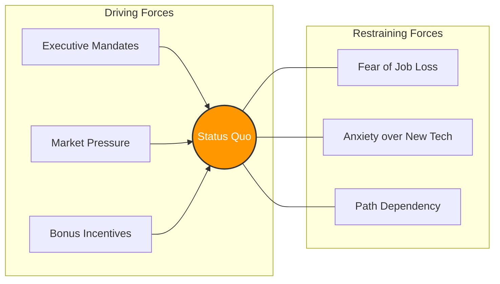

# Lewin's Force Field Analysis & 3-Stage Model: Breaking Psychological Defenses

> **Standards Alignment**: `CMI: Leading and Managing Change` | `ICPM: Leading and Directing`  
> **Core Literature**: Kurt Lewin (1947), *"Frontiers in Group Dynamics"*, Human Relations.

---

## 1. The Pain Point Scenario

!!! danger "Executive Crisis: The Failure of the Bonus Carrot"
    **"To push the adoption of a new automated HR system, management announced: Any department that fully transitions by the deadline gets an extra performance bonus (increasing driving forces). Yet, adoption lagged severely. Investigations revealed that frontline staff secretly feared the system would lead to layoffs (a massive restraining force), prompting passive-aggressive resistance. By only pushing harder, management nearly snapped the thread of employee trust."**

### Core Symptom Diagnosis
* **The Driving Force Fallacy**: Executives default to using authority or financial incentives to "drive" change, completely ignoring the underlying psychological fears of the workforce.
* **Skipping the Unfreeze Phase**: Mandating the execution of new processes before old habits and mindsets are dismantled guarantees extreme psychological pushback.

---

## 2. Theory Deconstruction: Force Field Analysis

Kurt Lewin posited that an organization's current state is a "dynamic equilibrium" maintained by two opposing forces. To disrupt the status quo and initiate change, you can either **increase Driving Forces** or **decrease Restraining Forces**.

Lewin’s core insight: **Simply piling on driving forces only increases the organizational "tension" and stress. The most effective change strategy is always to reduce the restraining forces first.**



---

## 3. Theory Deconstruction: The 3-Stage Change Model

To safely dismantle the status quo and establish a new normal, Lewin introduced his classic three-step process:

1. **Unfreeze**: **"Dismantling the Ice Block."** Acknowledging that the current way is no longer viable. This phase requires communicating urgency and addressing emotional defense mechanisms. The focus is on preparing the *people*, not just the process.
2. **Change (Transition)**: **"Navigating the Turbulence."** This is a transitional phase characterized by confusion, learning, and adjustment. Employees need time, psychological safety, and resources to trial-and-error the new behaviors.
3. **Refreeze**: **"Solidifying the New Shape."** Once the new behaviors prove effective, they must be immediately codified into SOPs, KPIs, corporate policies, and reward structures to prevent regression to old habits.

---

## 4. Certification Alignment

=== "CMI (Chartered Manager) Perspective"
* **Assessment Dimension**: `Overcoming Resistance to Change`
* **Practical Expectation**: Managers must demonstrate the ability to diagnose "hidden resistance." For example, identifying that resistance isn't due to technical incompetence, but rather "political resistance" from middle managers afraid of losing information monopolies.

=== "ICPM (Certified Manager) Perspective"
* **Assessment Dimension**: `Directing and Communicating`
* **High-Frequency Exam Focus**: Understanding that during the "Unfreeze" phase, the most effective leadership tools are **two-way communication and empathy**. Conversely, the "Refreeze" phase relies heavily on **structural design and policy reinforcement**.

---

## 5. Actionable Toolkit: Force Field Audit

!!! success "Manager's Resistance Neutralization Checklist"
*Before announcing any new policy, complete this audit:*

```
- [ ] **Communicating the "Why"**: Have we clearly articulated the existential threat of *not* changing (Unfreezing), rather than just painting a rosy picture of the future?
- [ ] **Fear Management**: What is the team most afraid of losing (status, time, security) due to this change? Do we have a specific countermeasure to neutralize this fear?
- [ ] **Transition Resources**: Have we temporarily adjusted regular KPI expectations to give the team a "buffer" to learn new skills during the turbulent Change phase?
