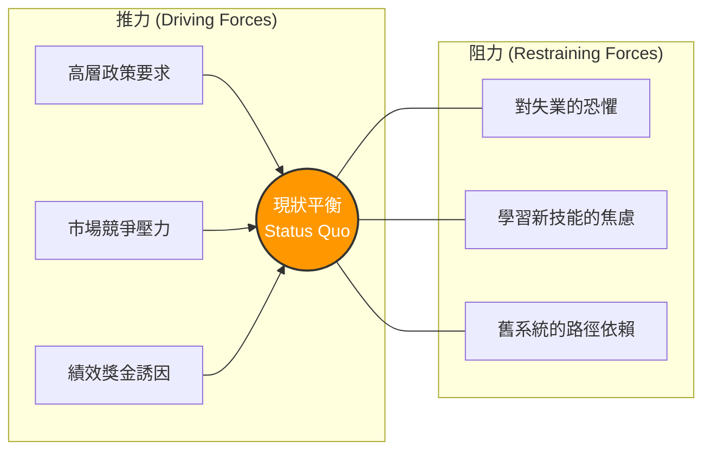

# Lewin 力場分析與三階段模型：破解員工的心理防禦

> **標準對齊**：`CMI: Leading and Managing Change` | `ICPM: Leading and Directing`  
> **核心文獻**：Kurt Lewin (1947), *"Frontiers in Group Dynamics"*, Human Relations.

---

## 1. 實戰痛點情境

!!! danger "高階治理危機：越推越不動的「獎金失效症」"
    **「為了推動全新的自動化 HR 系統，管理層宣布：只要部門在期限前完成系統切換，主管即可獲得額外績效獎金（增加推力）。然而，切換進度依然嚴重落後。調查後才發現，基層員工私下擔憂新系統會導致裁員（強大阻力），因此聯合起來消極抵抗。高層一味施加推力，反而讓勞資關係的張力瀕臨斷裂。」**

### 核心病徵診斷
* **推力迷思 (The Driving Force Fallacy)**：管理者習慣用權威或金錢來「推動」變革，卻忽略了員工內心的恐懼。
* **忽視解凍期**：在舊習慣尚未被打破前，直接要求員工執行新流程，導致極高的心理反彈。

---

## 2. 理論解構 1：力場分析 (Force Field Analysis)

Kurt Lewin 指出，組織的現狀是兩種對立力量達到的「動態平衡」。要打破現狀（推動變革），你有兩種選擇：**增加推力（Driving Forces）** 或 **減少阻力（Restraining Forces）**。

Lewin 的核心洞見在於：**單純增加推力只會增加組織的「彈簧張力」與壓力；最有效的變革策略，永遠是先「減少阻力」。**



---

## 3. 理論解構 2：變革三階段模型

為了安全地打破現狀平衡並建立新常態，Lewin 提出了經典的變革三部曲：

1. **解凍 (Unfreeze)**：**「製造破壞」**。承認現狀已經失效，透過溝通危機感（Urgency）來化解防禦機制。重點在於處理「人」的情緒，而非單純談論「事」。
2. **變革 / 轉變 (Change / Transition)**：**「穿越陣痛期」**。這是一個充滿混亂與學習的過渡階段。員工需要時間適應新流程，管理者必須提供大量的教育訓練與心理支持，允許試錯。
3. **再凍結 (Refreeze)**：**「固化新常態」**。當新行為開始奏效，必須立刻將其寫入 SOP、KPI 考核與企業政策中，防止員工退回舊習慣。

---

## 4. 國際認證考核對齊

=== "特許管理學會 (CMI) 考核視角"
* **核心評估點**：`Overcoming Resistance to Change`
* **實務要求**：經理人需展現出診斷「隱性阻力」的能力。例如，辨識出阻力並非來自技術困難，而是來自中階主管害怕失去資訊壟斷權的「政治阻力」。

=== "專業經理人學會 (ICPM) 考核視角"
* **核心評估點**：`Directing and Communicating`
* **高頻考點**：理解在「解凍期」，最有效的領導工具是**雙向溝通與同理心**；而在「再凍結期」，則必須仰賴**制度設計與獎酬結構**的硬性調整。

---

## 5. 實戰工具箱：力場掃描清單

!!! success "經理人變革阻力消除檢核表"
*在宣告任何新政策前，請先完成以下阻力盤點：*

```
- [ ] **痛點溝通**：我們是否清楚向團隊說明了「如果不改變，公司與個人會面臨什麼生存危機」（解凍），而不僅僅是畫大餅？
- [ ] **恐懼管理**：針對新系統，團隊最害怕失去什麼（地位、時間、安全感）？我們是否有具體對策來緩解這個恐懼？
- [ ] **陣痛期資源**：在「變革期」中，我們是否暫時調降了常態 KPI 標準，給予團隊學習新技能的緩衝時間？


