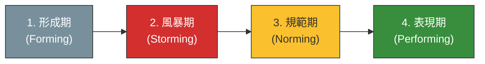

# Tuckman 團隊發展階段：跨部門協作的風暴生存指南

> **標準對齊**：`CMI: Leading and Managing Teams` | `ICPM: The Directing Function`  
> **核心文獻**：Bruce Tuckman (1965), *"Developmental Sequence in Small Groups"*, Psychological Bulletin.

---

## 1. 實戰痛點情境

!!! danger "專案治理危機：蜜月期後的跨部門內耗"
    **「公司剛成立『AI 治理跨部門工作小組』，首次會議中大家客氣且積極（形成期）。但兩週後，IT 部門與法務部開始為了『誰該為資料外洩承擔最終責任』發生激烈爭執，業務部則抱怨合規流程干擾業績。會議演變成互相推諉的戰場，專案進度完全停滯，主管們甚至考慮解散這個工作小組。」**

### 核心病徵診斷
* **對衝突的錯誤認知**：高階主管常誤以為「團隊有衝突代表專案失敗」或「選錯了人」，卻不知這是團隊走向成熟的必經陣痛（風暴期）。
* **領導風格錯位**：在團隊充滿情緒與角色衝突時，若專案負責人依然採用「放任式（Laissez-faire）」管理，期待大家「自己成熟點解決」，只會導致團隊崩解。

---

## 2. 理論解構：Tuckman 團隊發展四階段模型

心理學家 Bruce Tuckman 提出，任何新團隊的建立都不可能一蹴可幾，必須經歷四個動態階段。管理者在不同階段必須切換領導風格：



| 發展階段 | 團隊行為特徵 | 核心危機與痛點 | 經理人應對策略 (Leadership Style) |
| --- | --- | --- | --- |
| **1. 形成期 (Forming)** | 禮貌、依賴領導者、探索邊界 | 目標模糊，成員互相觀望 | **指揮型 (Directing)**：給予明確目標、定義角色與職責邊界。 |
| **2. 風暴期 (Storming)** | 權力鬥爭、抗拒任務、情緒化衝突 | 內耗嚴重，甚至導致專案流產 | **教練型 (Coaching)**：直面衝突，建立溝通底線，不迴避政治角力。 |
| **3. 規範期 (Norming)** | 建立默契、互相尊重、流程標準化 | 避免為了和諧而壓抑建設性意見 | **參與型 (Supporting)**：退居幕後，鼓勵團隊自主決策，固化 SOP。 |
| **4. 表現期 (Performing)** | 高度信任、自動導航、展現高績效 | 團隊疲乏或失去挑戰動力 | **授權型 (Delegating)**：專注於資源爭取與戰略對齊，慶祝成果。 |

---

## 3. 國際認證考核對齊

=== "特許管理學會 (CMI) 考核視角"
* **核心評估點**：`Managing Team Dynamics and Conflict`
* **實務要求**：經理人需展現如何主動介入「風暴期」，將破壞性衝突（Personal Conflict）轉化為建設性衝突（Task-related Conflict），並促成團隊共識。

=== "專業經理人學會 (ICPM) 考核視角"
* **核心評估點**：`Situational Leadership Integration`
* **高頻考點**：強調沒有「一體適用」的領導風格。考試常出情境題，要求判斷目前團隊處於哪一階段，並選出最適當的指導模式（如：風暴期不能放任，表現期不能微觀管理）。

---

## 4. 實戰工具箱：風暴期生存檢核表

!!! success "經理人跨部門衝突管理清單"
*當團隊陷入風暴期時，請立刻檢視以下機制：*

```
- [ ] **衝突升級路徑 (Escalation Path)**：團隊是否清楚，當兩部門意見僵持不下時，應該找誰仲裁，而不是在會議室裡無限迴圈？
- [ ] **角色重塑 (Role Clarity)**：爭執通常源於「灰色地帶」。我是否已重新召集關鍵成員，利用 ARCI (RACI) 矩陣釐清最終決策權？
- [ ] **心理安全感 (Psychological Safety)**：我是否在會議中明確表態「針對流程的激辯是被鼓勵的，但針對個人的攻擊是零容忍的」？
