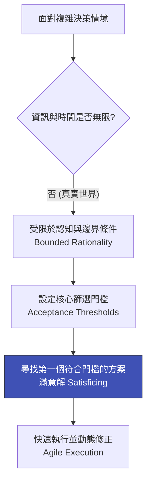

# Herbert Simon 有限理性與滿意決策：打破追求完美的決策迷思

> **標準對齊**：`CMI: Decision Making` | `ICPM: Problem Solving and Decision Making`  
> **核心文獻**：Herbert A. Simon (1947), *"Administrative Behavior"* | Nobel Prize in Economics (1978).

---

## 1. 實戰痛點情境

!!! danger "高階治理危機：因追求「最優解」而陷入的分析癱瘓"
    **「公司準備導入一項全新的跨國 AI 供應商系統。技術委員會為了找到『功能最完美、成本最低、合規風險為零』的最優解，歷時九個月進行了無休止的評估與競標。結果在延宕期間，市場競爭對手早已藉由次佳但足夠成熟的系統搶佔先機，而原本看中的 AI 技術也面臨更新換代。追求絕對理性的『完美決策』，最終變成了致命的延誤。」**

### 核心病徵診斷
* **古典經濟學的迷思**：誤以為決策者擁有無限的時間、運算能力與全知資訊，總能在眾多選項中精準挑出「最佳解 (Optimizing)」。
* **分析癱瘓 (Analysis Paralysis)**：在面對複雜的現代企業治理與合規議題（如 GDPR、AI 法案）時，因資訊過載而導致決策遲滯不前。

---

## 2. 理論解構：有限理性與「滿意原則」

諾貝爾獎得主赫伯特·西蒙（Herbert Simon）提出 **有限理性 (Bounded Rationality)**，挑戰了傳統的絕對理性假設。他指出，人類的認知能力、資訊獲取管道與時間永遠是有限的。

因此，在真實世界的商業博弈中，高明的主管不追求不存在的「最優解」，而是追求**「滿意解 (Satisficing)」**——這個詞由 *Satisfy*（滿足）與 *Suffice*（夠用）複合而成。

### 滿意決策的三大核心步驟

1. **定義底線門檻 (Cutoff Criteria)**：在決策前明確列出「絕對不能踩的紅線」（例如：合規風險必須為零、預算不得超過上限）。
2. **依序搜尋而非全域對比**：不盲目蒐集所有可能的選項，而是依序檢視方案，只要第一個選項達標就停止搜尋。
3. **敏捷迭代修正**：接受決策在當下是不完美的，並透過後續的執行與回饋機制進行動態優化。

---

## 3. 國際認證考核對齊

=== "特許管理學會 (CMI) 考核視角"
* **核心評估點**：`Informed Decision Making under Uncertainty`
* **實務要求**：經理人需展現如何在資訊不對稱、時間緊迫的動態環境中做出權衡，並向董事會說明為何某個「滿意且可控」的方案優於遙不可及的完美計畫。

=== "專業經理人學會 (ICPM) 考核視角"
* **核心評估點**：`Problem Solving Constraints`
* **高頻考點**：考題經常要求區分「確定期 (Certainty)」、「風險期 (Risk)」與「不確定性 (Uncertainty)」下的決策差異。有限理性主要應用於高度不確定的複雜管理場景。

---

## 4. 實戰工具箱：決策門檻檢核表

!!! success "經理人防範分析癱瘓清單"
- [ ] **停止盲目搜尋**：我們是否已經設定了清晰的「停止條件」？當某個方案滿足了 80% 的核心需求時，是否就果斷拍板？
- [ ] **辨識認知限制**：我們在評估此專案時，是否過度依賴過去的直覺（Heuristics），而忽略了環境條件已經改變？
- [ ] **回饋迴圈設計**：既然當下的決策只是「滿意解」，我們是否建立了一套快速回饋與糾錯機制，以防範未知的長尾風險？
