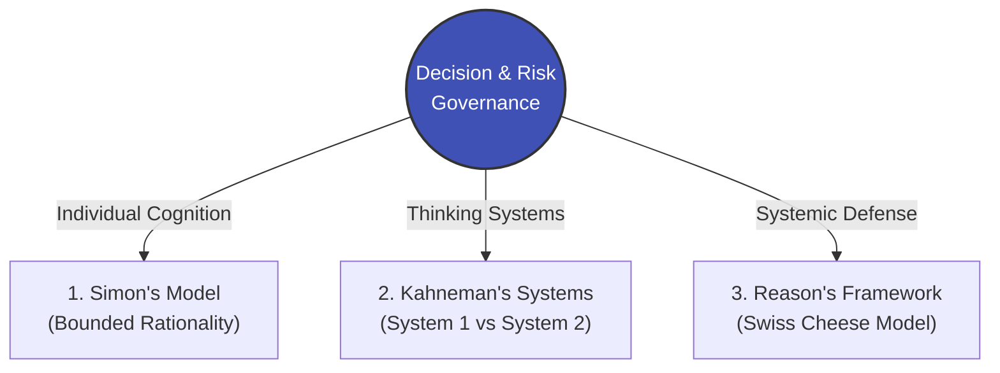

# Module 04 Overview: Decision Making & Risk Governance

> **Module Focus**: Neutralizing executive blind spots and establishing systemic defenses against operational risks.  
> **Aligned Standards**: `CMI: Decision Making and Risk Management` | `ICPM: Problem Solving and Controlling`

---

## 1. The Pain Point Scenario

!!! danger "The Boardroom Trap: Unchecked Efficiency and Invisible Risks"
    **"Driven by a desire for extreme administrative efficiency, the board mandated the immediate company-wide deployment of Generative AI tools (e.g., Microsoft 365 Copilot). Executives rapidly signed off on the budget based on 'gut feeling and market hype.' However, lacking systemic risk assessment and strict access controls, frontline employees inadvertently used the AI to retrieve unreleased HR salary data and confidential board minutes within the first week. A blind 'efficiency decision' instantly spiraled into a massive corporate compliance crisis."**

### Core Symptom Diagnosis
* **Executive Overconfidence**: Senior leaders rely too heavily on past successes (heuristics), underestimating the long-tail risks introduced by novel technologies or paradigm shifts.
* **Bounded Rationality**: Faced with information overload and tight deadlines, decision-makers settle for "satisficing" (good enough) options rather than "optimizing" ones, dangerously ignoring fatal blind spots just outside their view.
* **Single Point of Failure**: Organizations often rely on a single layer of defense (e.g., an employee NDA). When that first layer is breached, there is no defense-in-depth mechanism to contain the fallout.

---

## 2. Theoretical Framework Map

This module equips managers with enterprise-grade risk filters, spanning from individual psychological biases to organizational defense architectures:



* **[Theory 1: Simon's Bounded Rationality](https://www.google.com/search?q=%23)**: Understand why "perfect decision-making" is an illusion, and learn how managers can set practical and safe decision boundaries.
* **[Theory 2: Kahneman’s System 1 and System 2](https://www.google.com/search?q=%23)**: Deconstruct common boardroom biases—like Confirmation Bias and Overconfidence—and learn when to forcibly engage the analytical rigor of System 2.
* **[Theory 3: Reason’s Swiss Cheese Model](https://www.google.com/search?q=%23)**: Apply this disaster-prevention model from aviation and healthcare to modern corporate compliance, AI deployment, and cross-functional operations.

---

## 3. Certification Alignment

=== "CMI (Chartered Manager) Perspective"
* **Assessment Dimension**: `Making a Financial Case and Managing Risk`
* **Core Evaluation**: Can the manager balance ROI with potential exposure when championing new initiatives (like digital transformation), and create a comprehensive risk matrix encompassing avoidance, transference, mitigation, and acceptance?

=== "ICPM (Certified Manager) Perspective"
* **Assessment Dimension**: `Decision Making and Problem Solving`
* **High-Frequency Exam Focus**: Distinguishing between "Programmed Decisions" (which require strict SOPs) and "Non-programmed Decisions" (which require diverse perspectives to avoid Groupthink).

---

## 4. Actionable Toolkit: Major Decision Failsafe Audit

!!! success "Manager's Decision & Risk Checklist"
*Before signing off on any major cross-functional or new-tech initiative, verify the following:*

```
- [ ] **Falsification Test**: Have we intentionally assigned a "Devil's Advocate" in our strategy meetings to aggressively poke holes in this proposal?
- [ ] **Blind Spot Check**: Has this decision undergone independent risk reviews by non-commercial departments (e.g., Legal, HR, IT Security)?
- [ ] **Defense in Depth**: If our primary defense (e.g., employee policy training) fails, do we have a secondary physical or systemic barrier (e.g., automated Data Loss Prevention systems) to catch the error?
