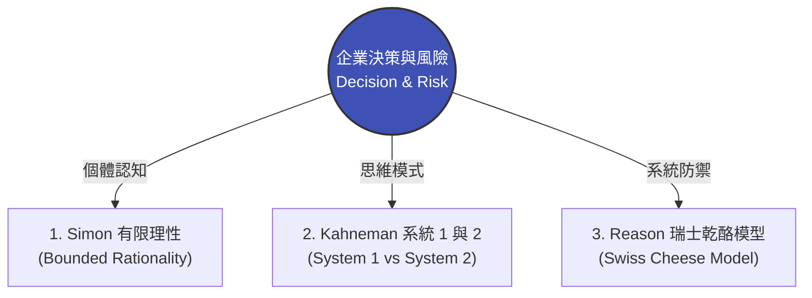

# 模組 04 總覽：決策思維與風險治理

> **模組定位**：破解高階決策盲點，建立抵禦未知風險的系統性防線。  
> **對齊標準**：特許管理學會（CMI）決策與風險管理 | 美國專業經理人學會（ICPM）控制與決策職能

---

## 1. 實戰痛點情境

!!! danger "高階治理陷阱：失控的效率與隱形風險"
    **「董事會為了追求極致的行政效率，強勢下令全公司導入 Microsoft 365 Copilot 等生成式 AI 工具。高管們基於『直覺與市場熱度』迅速簽核了預算。然而，由於缺乏系統性的風險評估與權限控管，上線第一週，基層員工就透過 AI 意外檢索到了未公開的 HR 薪酬數據與高層會議紀錄。一次盲目的『效率決策』，最終演變成嚴重的企業合規危機。」**

### 核心病徵診斷
* **決策過度自信**：高階主管依賴過去的成功經驗（捷思法），低估了新技術或新市場帶來的長尾風險。
* **有限理性 (Bounded Rationality)**：在資訊爆炸且時間緊迫的情況下，決策者往往選擇「夠好（Satisficing）」的方案，而非「最佳（Optimizing）」方案，卻忽略了邊界外的致命盲點。
* **防護網的單點失效**：企業往往過度依賴單一防線（例如只靠一紙員工保密協議），當第一道防線被突破時，缺乏縱深防禦（Defense in Depth）機制。

---

## 2. 模組理論解構地圖

本模組將從「個人決策心理」到「組織風險架構」，為經理人配備企業級的風險濾網：



* **[理論一：Simon 的有限理性與滿意決策](https://www.google.com/search?q=%23)**：了解為何「追求完美決策」是不切實際的，經理人該如何設定合理的決策邊界（Decision Boundaries）。
* **[理論二：Kahneman 的快思慢想與認知偏誤](https://www.google.com/search?q=%23)**：破解董事會中最常見的「確認偏誤」與「過度自信」，學會在關鍵時刻強制啟動系統 2 的深度思考。
* **[理論三：Reason 的瑞士乾酪模型 (Swiss Cheese Model)](https://www.google.com/search?q=%23)**：將醫療與飛安領域的災難防禦模型，應用於現代企業的資安治理、AI 部署與跨部門合規設計中。

---

## 3. 國際認證考核對齊

=== "特許管理學會（CMI）視角"
* **考核維度**：`Making a Financial Case and Managing Risk`
* **核心評估點**：經理人能否在推動新專案（如數位轉型）時，平衡 ROI（投資回報率）與潛在風險，並建立包含迴避、轉移、減輕與接受的綜合風險矩陣。

=== "專業經理人學會（ICPM）視角"
* **考核維度**：`Decision Making and Problem Solving`
* **高頻考點**：區分「常規性決策（Programmed Decisions）」與「非常規性決策（Non-programmed Decisions）」。對於前者應建立 SOP，對後者則需引入多元視角以避免群體思維（Groupthink）。

---

## 4. 實戰工具箱：重大決策防呆清單

!!! success "經理人決策與風險檢核"
*在簽核任何牽涉跨部門或新技術導入的重大專案前，請確認：*

```
- [ ] **反證測試 (Falsification Test)**：我們是否在會議中，刻意指派了一位「魔鬼代言人（Devil's Advocate）」來全力反駁這個提案？
- [ ] **盲點偵測 (Blind Spot Check)**：這項決策是否已經過法務、HR、IT 等非業務單位的獨立風險審查？
- [ ] **防線縱深 (Defense in Depth)**：如果第一道防線（如：員工教育訓練）失效，我們是否有第二道物理或系統防線（如：自動阻擋敏感資料的外洩防護系統）？

