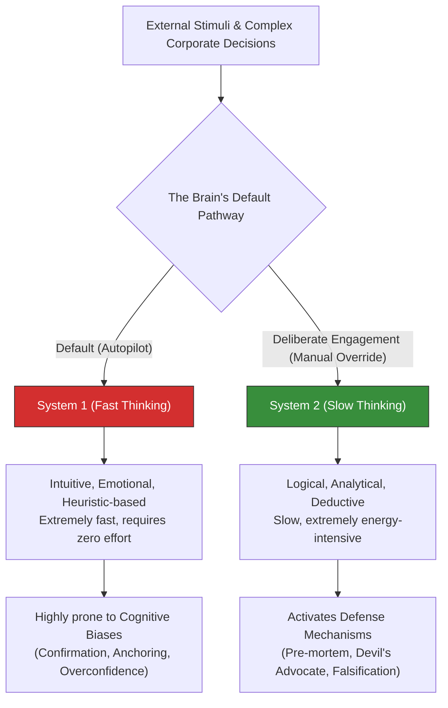

# Kahneman's System 1 & 2: Neutralizing Boardroom Cognitive Biases

> **Standards Alignment**: `CMI: Critical Thinking and Decision Making` | `ICPM: Problem Solving and Decision Making`  
> **Core Literature**: Daniel Kahneman (2011), *"Thinking, Fast and Slow"* | Nobel Prize in Economics (2002).

---

## 1. The Pain Point Scenario

!!! danger "Executive Crisis: The AI Procurement Hijacked by Intuition and Bias"
    **"The company was preparing to procure an 'AI HR Resume Screening System.' The vendor's initial quote was astronomically high (Anchoring Effect). To justify the budget, the championing HR director exclusively searched for case studies of the system's successes, completely ignoring news of failed implementations or algorithmic discrimination lawsuits (Confirmation Bias). Upon deployment, the company faced a massive legal and PR crisis due to inherent gender biases in the AI. A decision that initially 'felt right' became a governance disaster."**

### Core Symptom Diagnosis
* **Abuse of Heuristics**: To conserve energy, the brain relies on past rules of thumb for new problems. While efficient in familiar territory, relying on intuition when facing unprecedented domains like AI governance is often fatally flawed.
* **Groupthink Amplification**: In a boardroom, once the top executive sets the tone based on a gut feeling (Fast Thinking), team members often actively seek evidence to support that premise (Confirmation Bias), compounding the initial error.

---

## 2. Theory Deconstruction: The Dual-Process Theory

Nobel Laureate Daniel Kahneman posits that human cognition relies on two distinct systems. The art of executive management lies in knowing when to trust "System 1" and when to forcefully engage the energy-intensive "System 2."



### The Three Deadliest Boardroom Biases

1. **Confirmation Bias**: Hearing only what you want to hear. Decision-makers subconsciously filter out objective data that contradicts their pre-existing beliefs.
2. **Anchoring Effect**: Over-relying on the first piece of information offered (e.g., a vendor's initial quote, a historical budget) and making woefully inadequate adjustments from that baseline.
3. **Overconfidence**: Confusing "luck" with "skill," and systematically underestimating the probability of project failure or unknown risks (Black Swan events).

---

## 3. Certification Alignment

=== "CMI (Chartered Manager) Perspective"
* **Assessment Dimension**: `Critical Thinking in Management`
* **Practical Expectation**: Managers must demonstrate "critical thinking" by identifying cognitive biases in the decision-making process and introducing objective data and diverse perspectives to suppress System 1 impulses.

=== "ICPM (Certified Manager) Perspective"
* **Assessment Dimension**: `Evaluating Alternatives`
* **High-Frequency Exam Focus**: When evaluating alternatives, exams often require managers to construct objective "Evaluation Matrices." This structural tool forces the activation of System 2, preventing managers from selecting the most intuitively appealing option.

---

## 4. Actionable Toolkit: The Pre-mortem and Bias Audit

!!! success "Manager's System 2 Activation Checklist"
*Force these steps before signing off on major compliance or budgetary decisions:*

```
- [ ] **The Pre-mortem**: Imagine it is one year from now, and this project has *spectacularly failed*. Write down the top 3 most likely reasons for this disaster.
- [ ] **Breaking the Anchor**: Before looking at the vendor's quote or historical budgets, have we independently conducted a Should-Cost analysis?
- [ ] **Falsification Search**: If we are strongly leaning towards Option A, has someone been explicitly assigned to gather objective data proving why Option A will fail?
