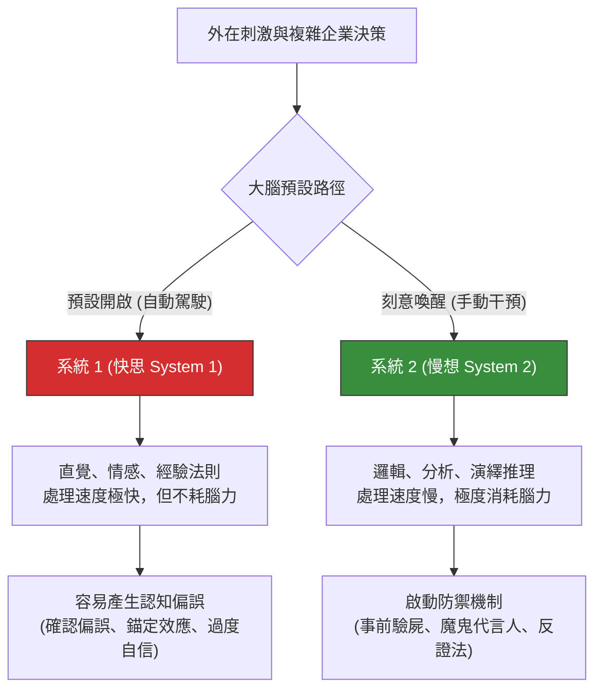

# Kahneman 快思慢想與認知偏誤：破解董事會的決策盲區

> **標準對齊**：`CMI: Critical Thinking and Decision Making` | `ICPM: Problem Solving and Decision Making`  
> **核心文獻**：Daniel Kahneman (2011), *"Thinking, Fast and Slow"* | Nobel Prize in Economics (2002).

---

## 1. 實戰痛點情境

!!! danger "高階治理危機：被直覺與偏誤綁架的 AI 採購案"
    **「公司準備採購一套『AI 人資履歷篩選系統』。供應商在首次報價時開出了極高的天價（錨定效應）。隨後，推動專案的 HR 主管為了證明這筆預算合理，只在網路上搜尋該系統成功的案例，完全忽略了其他企業導入失敗或涉嫌演算法歧視的負面新聞（確認偏誤）。最終系統上線，公司因 AI 篩選存在性別偏見而面臨巨大的法律與公關危機。當初『感覺很棒』的決策，成了災難的開端。」**

### 核心病徵診斷
* **捷思法 (Heuristics) 的濫用**：大腦為了節省能量，傾向使用過去的經驗法則來處理新問題。在熟悉的領域這很高效，但在面對 AI 治理等全新領域時，直覺往往是錯的。
* **群體盲思 (Groupthink)**：在會議室中，當最高主管憑藉直覺（快思）定下基調後，團隊成員往往會主動尋找證據來支持該論點（確認偏誤），使得錯誤決策被無限放大。

---

## 2. 理論解構：系統 1 與系統 2 的雙軌思維

諾貝爾獎得主康納曼（Daniel Kahneman）指出，人類大腦運作依賴兩套截然不同的系統。高階管理的藝術，在於知道何時該信任「系統 1」，何時該強制啟動耗能的「系統 2」。



### 董事會中最致命的三大認知偏誤

1. **確認偏誤 (Confirmation Bias)**：只聽得進自己想聽的。決策者會下意識地過濾掉與自己既有信念衝突的客觀數據。
2. **錨定效應 (Anchoring Effect)**：過度依賴第一時間獲得的資訊（如供應商的初始報價、歷史專案的預算），並以此為基準進行極為有限的調整。
3. **過度自信 (Overconfidence)**：錯把「運氣」當作「實力」，低估了專案失敗的機率與未知風險（黑天鵝事件）。

---

## 3. 國際認證考核對齊

=== "特許管理學會 (CMI) 考核視角"
* **核心評估點**：`Critical Thinking in Management`
* **實務要求**：經理人需展現「批判性思考」能力，證明自己能夠識別決策過程中的認知偏誤，並透過引入客觀數據與多元視角來抑制系統 1 的衝動。

=== "專業經理人學會 (ICPM) 考核視角"
* **核心評估點**：`Evaluating Alternatives`
* **高頻考點**：在評估替代方案時，考題常要求經理人建立客觀的「評估矩陣 (Evaluation Matrix)」，這正是為了強迫啟動系統 2，避免管理者憑直覺選取看似最順眼的方案。

---

## 4. 實戰工具箱：事前驗屍與偏誤檢核

!!! success "經理人強制啟動系統 2 清單"
*在簽署重大合規或預算決策前，強制執行以下步驟：*

```
- [ ] **事前驗屍 (Pre-mortem)**：假設現在是一年後，這個專案「已經徹底失敗」了。請團隊寫下導致失敗的 3 個最可能原因。
- [ ] **破除錨定**：在看供應商報價或歷史預算之前，我們是否已經獨立進行了成本結構分析（Should-cost analysis）？
- [ ] **反向尋找證據**：如果我們目前強烈傾向方案 A，是否有人專門負責去蒐集「方案 A 絕對會失敗」的客觀數據？
