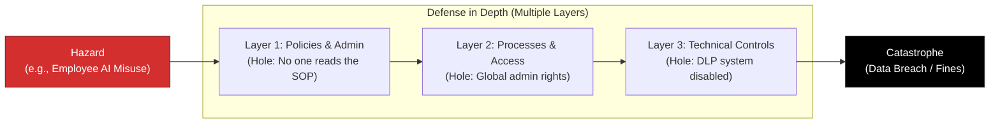

# Reason's Swiss Cheese Model: Building Enterprise Defense in Depth

> **Standards Alignment**: `CMI: Managing Risk` | `ICPM: The Controlling Function`  
> **Core Literature**: James Reason (1990), *"Human Error"*.

---

## 1. The Pain Point Scenario

!!! danger "Executive Crisis: The Fragility of Relying on an NDA"
    **"To prevent data leaks, HR mandated that all employees sign a strict 'AI Usage Non-Disclosure Agreement (NDA)'. One day, a senior specialist rushing to finish a boardroom presentation fed unreleased M&A financial projections directly into public ChatGPT. The data was subsequently ingested by external models. During the fallout, executives fumed: 'Didn't they sign the NDA?' The reality is, when facing complex human behavior and technology, a single administrative barrier is as fragile as paper."**

### Core Symptom Diagnosis
* **Single Point of Failure**: The enterprise gambled its entire risk management strategy on "employee vigilance" and a single policy document. Once this layer was breached, disaster struck immediately.
* **Ignoring Latent Conditions**: Disasters are rarely just one employee's fault. They are incubated by systemic flaws (e.g., the company failed to provide a secure, internal enterprise AI tool, leaving employees to find risky workarounds).

---

## 2. Theory Deconstruction: Slices of Defense

Developed by British psychologist James Reason, the Swiss Cheese Model was originally used to analyze aviation and healthcare disasters, but it has become the gold standard for corporate compliance and risk governance.

The model posits that an organization's defense systems are like slices of Swiss cheese. Each slice represents a "barrier," and the holes represent "flaws or failures" in that barrier. **A catastrophic error occurs only when the holes in multiple slices momentarily align, allowing the hazard to pass through all defenses.**



### The Three Standard Slices of "Defense in Depth"

1. **Administrative Controls**: SOPs, Codes of Conduct, employee training, and disciplinary policies.
2. **Logical / Process Controls**: Principle of Least Privilege (Zero Trust), Maker-Checker protocols (dual approvals).
3. **Physical / Technical Controls**: Automated systemic blocks, data masking algorithms, and Data Loss Prevention (DLP) firewalls.

---

## 3. Certification Alignment

=== "CMI (Chartered Perspective)"
* **Assessment Dimension**: `Risk Identification and Mitigation`
* **Practical Expectation**: Managers must demonstrate how to design comprehensive risk mitigation plans. For high-impact risks (like data breaches), presenting a single countermeasure is insufficient; robust technical and administrative layers must be deployed simultaneously.

=== "ICPM (Certified Manager) Perspective"
* **Assessment Dimension**: `Concurrent and Feedforward Controls`
* **High-Frequency Exam Focus**: The Swiss Cheese Model perfectly illustrates the need for a comprehensive control system integrating "Feedforward (preventing holes)," "Concurrent (systemic blocks)," and "Feedback (disaster response)" mechanisms.

---

## 4. Actionable Toolkit: Defense Network Stress Test

!!! success "Manager's Defense-in-Depth Audit"
*For any high-risk process (e.g., core system deployment, sensitive data handling), verify the following:*

```
- [ ] **Eliminate Single Dependencies**: If an operator is exhausted today and forgets the SOP, will our system "automatically" physically or logically prevent them from making a fatal error?
- [ ] **Latent Condition Sweep**: Are we tacitly encouraging employees to bypass security protocols (creating latent holes) just to meet aggressive operational KPIs?
- [ ] **Heterogeneous Layers**: Are our defenses varied? (i.e., you cannot have three layers of "manual visual inspection"; you must introduce automated technological checks so the 'holes' do not align).

