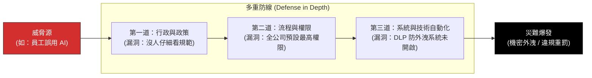

# Reason 瑞士乾酪模型：建構企業級縱深防禦

> **標準對齊**：`CMI: Managing Risk` | `ICPM: The Controlling Function`  
> **核心文獻**：James Reason (1990), *"Human Error"*.

---

## 1. 實戰痛點情境

!!! danger "高階治理危機：只靠一紙保密協議的脆弱防線"
    **「為了防止機密外洩，HR 要求全體員工簽署了嚴格的『AI 使用保密協議 (NDA)』。某天，一位趕進度的資深專員，為了快速產出董事會簡報，將未公開的併購財務預測直接丟進了公共版 ChatGPT。隨後資料遭到外部模型擷取。事後究責時，高層震怒：『我們不是有簽保密協議嗎？』但現實是，面對複雜的人性與技術，單一的行政防線薄如蟬翼。」**

### 核心病徵診斷
* **單點失效 (Single Point of Failure)**：企業將風險管理的重擔，全部押注在「員工的道德自覺」或「單一政策文件」上。只要這道防線被突破，災難就會直接發生。
* **忽視潛在條件 (Latent Conditions)**：災難的發生通常不是單一員工的錯，而是系統早已存在隱患（如：公司並未提供內部安全版本的 AI 工具、權限過度開放）。

---

## 2. 理論解構：瑞士乾酪與防線縱深

英國心理學家 James Reason 提出的「瑞士乾酪模型」，原用於飛安與醫療疏失分析，現已成為企業合規與風險管理的核心框架。

模型指出：企業的防禦系統就像一疊瑞士乾酪，每一片起司代表一道「防線」，而起司上的孔洞代表「防線的漏洞」。**當所有起司的孔洞在某個瞬間連成一線時，威脅就會穿透所有防線，導致災難。**



### 建立縱深防禦 (Defense in Depth) 的三道標準起司

1. **行政控制 (Administrative Controls)**：SOP、行為準則、員工教育訓練、懲處政策。
2. **邏輯/流程控制 (Logical Controls)**：最小權限原則 (Zero Trust)、跨部門雙重核准機制 (Maker-Checker)。
3. **物理/技術控制 (Technical Controls)**：系統強制攔截、去識別化演算法、自動阻擋敏感字詞上傳。

---

## 3. 國際認證考核對齊

=== "特許管理學會 (CMI) 考核視角"
* **核心評估點**：`Risk Identification and Mitigation`
* **實務要求**：經理人需展現如何設計綜合風險緩解計畫。當辨識出高影響力的風險（如資料外洩）時，不能只提出單一對策，必須同時部署政策面與技術面的預防措施。

=== "專業經理人學會 (ICPM) 考核視角"
* **核心評估點**：`Concurrent and Feedforward Controls`
* **高頻考點**：瑞士乾酪模型完美呼應了「事前控制 (預防漏洞)」、「事中控制 (系統攔截)」與「事後控制 (災難應變)」的全面控制體系。

---

## 4. 實戰工具箱：企業防護網壓力測試

!!! success "經理人防呆機制檢核表"
*針對任何高風險流程（如核心系統上線、敏感資料處理），請確認：*

```
- [ ] **消除單點依賴**：如果操作人員今天精神不濟、忘記看 SOP，我們的系統是否會「自動」阻止他犯下大錯？
- [ ] **系統性隱患排查**：我們是否為了追求 KPI 速度，而在流程設計上「默許」員工繞過安全查核機制（Latent Conditions）？
- [ ] **漏洞錯開設計**：我們的防線是否具有異質性？（例如：不能三道防線全都是「人工肉眼檢查」，必須加入自動化比對，讓孔洞不會連成一線）。
