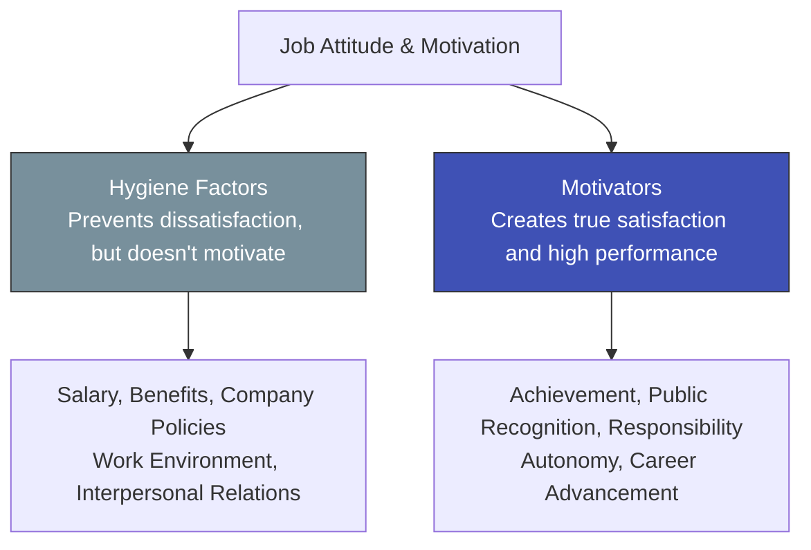

# Herzberg's Dual-Factor Theory: Why Pay Raises Can't Buy Long-Term Passion

> **Standards Alignment**: `CMI: Leading and Managing Teams` | `ICPM: The Actuating and Directing Function`  
> **Core Literature**: Frederick Herzberg (1959), *"The Motivation to Work"*.

---

## 1. The Pain Point Scenario

!!! danger "HR Crisis: The Diminishing Returns of the Pay Bump"
    **"To boost sagging morale, the company implemented a 10% company-wide pay raise early in the year and completely renovated the office and pantry. Employees were ecstatic for the first month, but by month three, productivity flatlined again, and complaints arose that 'competitors have better perks.' The HR Director is frustrated: 'We gave them top-tier salaries and environments, why can't we ignite genuine passion for the work itself?'"**

### Core Symptom Diagnosis
* **The Diminishing Returns of Financial Incentives**: Managers mistakenly believe the opposite of "dissatisfaction" is "satisfaction." In reality, eliminating dissatisfaction (e.g., via higher pay) merely yields a neutral state of "no dissatisfaction"; it does not translate to long-term proactive engagement.
* **Ignoring Intrinsic Drivers**: A job that lacks challenge, meaning, or a sense of achievement will still cause burnout and apathy, even if it is performed in a gold-plated office.

---

## 2. Theory Deconstruction: Hygiene Factors vs. Motivators

American psychologist Frederick Herzberg discovered that the factors influencing employee attitudes are divided into two fundamentally different groups:

1. **Hygiene Factors**: Relate to the "work environment/context." If absent or inadequate, employees become extremely dissatisfied. However, no matter how much you improve them, they only "prevent dissatisfaction" and cannot generate genuine motivation.
2. **Motivators**: Relate to the "job content/value." These are the factors that produce immense job satisfaction, intrinsic drive, and a willingness to take ownership.



### Management Application: Job Enrichment

To truly motivate employees, bonuses are not enough. Managers must implement "Job Enrichment"—vertically expanding a job by delegating planning, control, and decision-making authority down to the employee, thereby creating space for self-actualization and achievement.

---

## 3. Certification Alignment

=== "CMI (Chartered Manager) Perspective"
* **Assessment Dimension**: `Motivating Teams to Achieve Goals`
* **Practical Expectation**: Managers must demonstrate the ability to design "Non-financial Rewards." For instance, delegating the leadership of a cross-functional project (a Motivator) rather than simply tossing out a cash bonus (a Hygiene Factor).

=== "ICPM (Certified Manager) Perspective"
* **Assessment Dimension**: `Content Theories of Motivation`
* **High-Frequency Exam Focus**: Distinguishing between Maslow and Herzberg. Exams test situational awareness: if an employee complains the office is too cold or the boss is abrasive, that is a lack of Hygiene Factors. If they complain the work is tedious and unchallenging, that is a lack of Motivators.

---

## 4. Actionable Toolkit: The Dual-Factor Audit

!!! success "Manager's Motivation Checklist"
*When facing team morale issues, verify in this sequence:*

```
- [ ] **Fix Hygiene First**: Have we neutralized the "toxic factors" that cause active dissatisfaction? (e.g., highly unreasonable overtime policies, toxic cross-departmental communication).
- [ ] **Create Recognition**: In the past 30 days, have I given specific, public, and genuine praise to an employee for a specific contribution, rather than just handing out a bonus?
- [ ] **Expand Autonomy**: Can we delegate micro-level decisions (previously hoarded by management) down to capable frontline employees to give them a sense of ownership?

```
