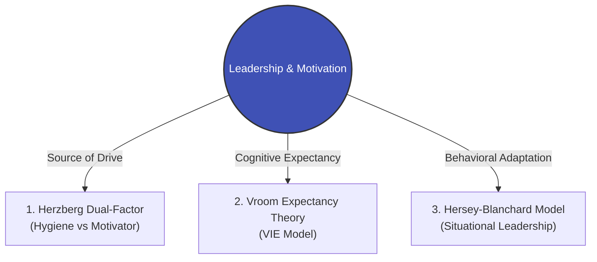

## 1. The Pain Point Scenario

!!! danger "Executive & HR Crisis: The 'Quiet Quitting' Post-Pay Raise"
    **"To retain key talent in a critical division, the company implemented an across-the-board 15% salary increase during the annual review. Three months later, turnover remained high, and team engagement plummeted further. Frustrated executives lamented: 'We paid them top dollar, why won't anyone go the extra mile?' The leadership found itself trapped in a cycle where financial rewards failed to inspire initiative."**

### Core Symptom Diagnosis
* **Confusing Hygiene with Motivators**: Compensation, benefits, and working conditions merely "eliminate dissatisfaction"; they do not generate sustainable, intrinsic "motivation."
* **Broken Expectancy Links**: Employees believe that "extra effort will not guarantee meeting unrealistic KPIs, and hitting targets will not yield the rewards they actually value."
* **Inflexible Leadership Styles**: Managers default to a single management mode (either micro-management or total neglect) regardless of individual variations in competence and commitment.

---

## 2. Theoretical Framework Map

This module equips leaders with a comprehensive motivation toolkit across intrinsic psychology, cognitive decision-making, and situational adaptability:



* **[Theory 1: Herzberg's Dual-Factor Theory](https://www.google.com/search?q=%23)**: Understand the fundamental distinction between eliminating dissatisfaction and creating genuine engagement through responsibility, autonomy, and recognition.
* **[Theory 2: Vroom's Expectancy Theory (VIE Model)](https://www.google.com/search?q=%23)**: Deconstruct the psychological formula of motivation ($\text{Effort} \to \text{Performance} \to \text{Rewards}$) to pinpoint systemic breakdowns in incentives.
* **[Theory 3: Hersey-Blanchard Situational Leadership (SLII)](https://www.google.com/search?q=%23)**: Guide managers on shifting dynamically between Directing, Coaching, Supporting, and Delegating based on employee maturity.

---

## 3. Certification Alignment

=== "CMI (Chartered Manager) Perspective"
* **Assessment Dimension**: `Leading and Managing Teams`
* **Core Evaluation**: Can the manager evaluate diverse motivation models, deploy non-financial incentives, and tailor leadership approaches to various developmental stages within a cross-functional team?

=== "ICPM (Certified Manager) Perspective"
* **Assessment Dimension**: `The Actuating and Directing Function`
* **High-Frequency Exam Focus**: Distinguishing between Content Theories (e.g., Maslow, Herzberg) and Process Theories (e.g., Vroom Expectancy, Equity Theory), selecting the optimal managerial action in complex organizational scenarios.

---

## 4. Actionable Toolkit: Leadership Motivation Health Check

!!! success "Manager's Motivation & Leadership Audit"
*Before redesigning compensation or addressing team fatigue, verify the following:*

```
- [ ] **Motivator Audit**: Beyond baseline salary, have we designed clear career progression pathways and opportunities for autonomous project ownership?
- [ ] **Expectancy Alignment**: Do employees genuinely believe that given sufficient effort, the assigned performance targets are fair and achievable?
- [ ] **Situational Adaptation**: Do I deliberately differentiate my management style between a new joiner and a seasoned expert (Directing vs. Delegating)?
