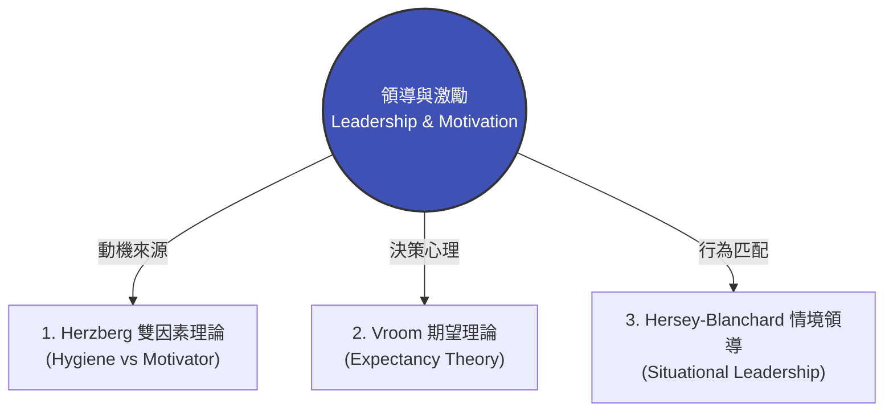

# 模組 05 總覽：領導力與組織激勵

> **模組定位**：破解薪酬迷思，建立從「外在驅動」到「自主賦能」的高績效領導架構。  
> **對齊標準**：特許管理學會（CMI）領導與管理團隊 | 美國專業經理人學會（ICPM）激勵與指揮職能

---

## 1. 實戰痛點情境

!!! danger "高階人資與管理危機：加薪後的「集體躺平症」"
    **「公司為了留住關鍵部門的核心人才，在年度調薪中全面調高了 15% 的底薪。然而三個月後，員工離職率並未顯著下降，團隊的產出效率與工作熱情反而更加低迷。主管們抱怨：『錢給夠了，為什麼大家還是不願意多走一步？』高層陷入了『重賞之下卻無勇夫』的無力循環。」**

### 核心病徵診斷
* **混淆「保健因素」與「激勵因素」**：薪資、福利與工作環境主要用於「消除不滿」，並不能單獨產生長期的「工作熱情」。
* **激勵路徑斷裂**：員工認為「努力未必能達成 KPI，即使達成了也不會得到自己真正渴望的獎勵」，導致心理期望值歸零。
* **單一領導風格僵化**：主管習慣用同一種管理方式（如微觀管理或完全放任）對待所有成員，忽視了個別員工在「能力」與「意願」上的動態差異。

---

## 2. 模組理論解構地圖

本模組將從「動機本質」、「期望心理」到「領導情境」三個維度，為管理者構建系統化的激勵工具箱：



* **[理論一：Herzberg 雙因素理論](https://www.google.com/search?q=%23)**：透視「消除不滿」與「激發熱情」的根本分野，指導企業如何用成就感、責任感與自主權打造真正的激勵體系。
* **[理論二：Vroom 期望理論 (VIE 模型)](https://www.google.com/search?q=%23)**：拆解員工動力的心理公式（努力 $\to$ 績效 $\to$ 獎酬），精準定位激勵失效的結構性斷點。
* **[理論三：Hersey-Blanchard 情境領導模型 (SLII)](https://www.google.com/search?q=%23)**：教導經理人根據員工的「工作成熟度」（指導型、教練型、支持型、授權型），靈活切換管理手法。

---

## 3. 國際認證考核對齊

=== "特許管理學會 (CMI) 考核視角"
* **考核維度**：`Leading and Managing Teams`
* **核心評估點**：經理人能否評估不同的激勵模型，並在多元化的團隊中應用非金錢激勵策略；能否辨識個別成員的發展階段並給予最適當的指導。

=== "專業經理人學會 (ICPM) 考核視角"
* **考核維度**：`The Actuating and Directing Function`
* **高頻考點**：深入理解內容型激勵理論（如 Maslow、Herzberg）與過程型激勵理論（如 Vroom 期望理論、公平理論）的差異，並在情境案例中選出正確的領導行為。

---

## 4. 實戰工具箱：主管激勵體系健康度盤點

!!! success "經理人激勵與領導檢核清單"
*在評估團隊士氣低迷或重組獎酬方案前，請確認：*

```
- [ ] **激勵因子檢驗**：除了底薪與硬體設施外，我們是否為團隊成員設計了清晰的「職涯發展路徑」與「自主負責的專案空間」？
- [ ] **期望鏈路暢通**：員工是否真心相信「只要我付出努力，公司的考核標準是合理且可達成的」？
- [ ] **風格動態調適**：我對待新入職的新人與資深骨幹，是否採用了差異化的指導方式（指導 vs. 授權）？
