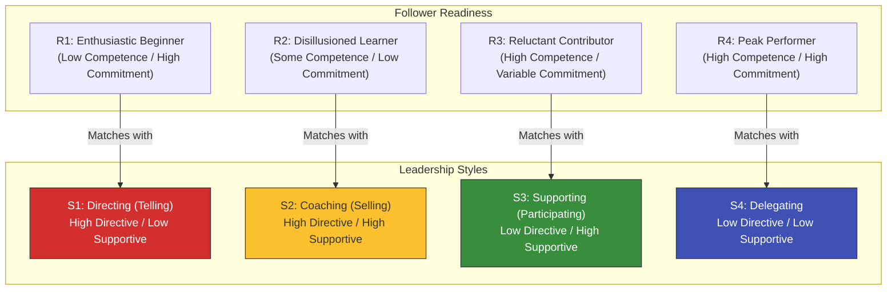

# Hersey-Blanchard Situational Leadership: Escaping the One-Size-Fits-All Trap

> **Standards Alignment**: `CMI: Leading and Managing Teams` | `ICPM: The Actuating and Directing Function`  
> **Core Literature**: Paul Hersey & Ken Blanchard (1969), *"Management of Organizational Behavior"*.

---

## 1. The Pain Point Scenario

!!! danger "HR Crisis: The Star Performer's Micromanagement Disaster"
    **"The company promoted its top-performing sales star to department head. To guarantee targets were met, he demanded twice-daily progress reports from everyone and personally revised every proposal. The result? Fresh recruits felt supported, but highly competent veterans felt deeply mistrusted. Two key senior players resigned in frustration. The bewildered manager complained to HR: 'I'm working so hard to guide them, why are they so ungrateful?'"**

### Core Symptom Diagnosis
* **Inflexible Leadership Style**: This manager applied a "High Directive" (micromanagement) style across the board. While effective for inexperienced novices, deploying this style on highly competent veterans is perceived as insulting and disruptive.
* **Ignoring Follower "Readiness"**: Leadership is not black and white. The most effective leadership style must be dynamically calibrated to a subordinate's "competence" and "commitment" regarding a *specific task*.

---

## 2. Theory Deconstruction: The Situational Leadership Model

Paul Hersey and Ken Blanchard argued that there is no single "best" leadership style. Leaders must evaluate the **Readiness (or Maturity)** of their followers and toggle between "Directive Behavior" (task focus) and "Supportive Behavior" (relationship focus).



### The Four Dynamic Leadership Strategies

1. **S1 Directing**: For brand new employees on a new task (R1). Provide clear, specific instructions, strict step-by-step guidance, and close supervision (one-way communication).
2. **S2 Coaching**: When an employee faces initial setbacks and loses motivation (R2). The manager must provide ongoing technical direction while heavily increasing emotional support and two-way dialogue.
3. **S3 Supporting**: When the employee is highly capable but lacks confidence or motivation (R3). The manager steps back, hands over decision-making power, and acts purely as a facilitator offering resources and psychological safety.
4. **S4 Delegating**: For autonomous experts (R4). The manager simply sets the strategic goals and boundaries, steps completely out of the way, and reallocates their own time to higher-level planning.

---

## 3. Certification Alignment

=== "CMI (Chartered Manager) Perspective"
* **Assessment Dimension**: `Adapting Leadership Styles`
* **Practical Expectation**: Managers must demonstrate "diagnostic capability." Exam scenarios often require assessing the developmental stages of different team members and justifying why Employee A requires micro-tracking while Employee B must be fully empowered.

=== "ICPM (Certified Manager) Perspective"
* **Assessment Dimension**: `The Directing Function`
* **High-Frequency Exam Focus**: The core focus is "matching." Mismatches are heavily tested: e.g., applying S1 (Directing) to an R4 (Expert) causes turnover; applying S4 (Delegating) to an R1 (Novice) causes catastrophic project failure.

---

## 4. Actionable Toolkit: Leadership Style Audit

!!! success "Manager's Situational Leadership Checklist"
*Before assigning the next critical task, ask yourself:*

```
- [ ] **Task-Specific Diagnosis**: Do I recognize that "readiness" is task-specific? (e.g., A senior salesperson is R4 when selling legacy products, but instantly drops to R1 when asked to operate a brand-new AI CRM system).
- [ ] **Curbing Micromanagement**: For team members currently at an R3 or R4 maturity level, have I stopped demanding tedious progress reports and shifted to evaluating purely by outcome?
- [ ] **Avoiding Premature Delegation**: For newly transferred employees (R1), have I provided explicit SOPs and milestone check-ins, rather than just saying "I trust you, go figure it out"?
