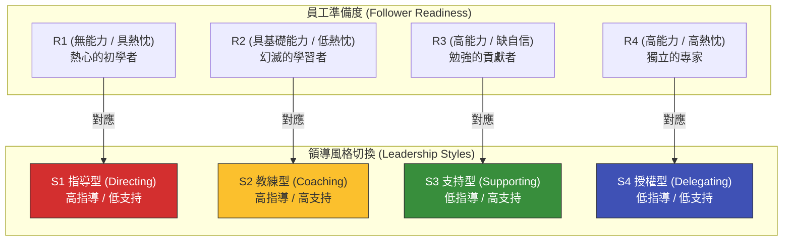

# Hersey-Blanchard 情境領導模型：告別一招打天下的管理盲點

> **標準對齊**：`CMI: Leading and Managing Teams` | `ICPM: The Actuating and Directing Function`  
> **核心文獻**：Paul Hersey & Ken Blanchard (1969), *"Management of Organizational Behavior"*.

---

## 1. 實戰痛點情境

!!! danger "高階人資危機：明星業務升官後的「微觀管理災難」"
    **「公司將業績最好的明星業務提拔為部門主管。為了確保團隊達標，他要求所有人每天回報兩次進度，並親自修改每一份提案。結果，剛入職的新人覺得他很可靠，但部門裡原本能獨立作戰的資深老將卻感到被強烈不信任，最終導致兩名核心骨幹憤而離職。這位主管崩潰地向 HR 抱怨：『我這麼認真帶團隊，為什麼他們卻不領情？』」**

### 核心病徵診斷
* **單一領導風格的僵化**：這名主管對所有人都採用「高指導 (High Directive)」的微觀管理。這種風格對無經驗的新手很有效，但對高能力的資深員工而言，卻是一種羞辱與干擾。
* **忽視員工的「準備度 (Readiness)」**：領導力並非絕對的黑與白，最有效的領導風格必須根據部屬在特定任務上的「能力」與「意願」進行動態調適。

---

## 2. 理論解構：情境領導模型 (Situational Leadership)

Hersey 與 Blanchard 指出，沒有任何一種領導風格是永遠「最佳」的。領導者必須評估部屬的**準備度 (Readiness / Maturity)**，並在「任務指導行為 (Directive)」與「關係支持行為 (Supportive)」之間切換。



### 四大動態領導策略

1. **S1 指導型 (Telling/Directing)**：針對剛接手新任務的新人 (R1)。給予明確的指示、步驟與嚴格的監督（單向溝通）。
2. **S2 教練型 (Selling/Coaching)**：當員工遭遇挫折、熱情消退時 (R2)。主管需要同時提供具體的技術指導，以及大量的情感鼓勵與雙向溝通。
3. **S3 支持型 (Participating/Supporting)**：員工已具備能力但缺乏自信或動力時 (R3)。主管應退居幕後，把決策權交給員工，僅從旁提供資源與心理支持。
4. **S4 授權型 (Delegating)**：針對能獨當一面的專家 (R4)。主管只需設定目標與邊界，然後徹底放權，把時間省下來去做戰略規劃。

---

## 3. 國際認證考核對齊

=== "特許管理學會 (CMI) 考核視角"
* **核心評估點**：`Adapting Leadership Styles`
* **實務要求**：經理人需展現「診斷能力」。考題常要求評估團隊中不同成員的發展階段，並說明為何對甲員工需要微觀跟進，而對乙員工卻應該完全授權。

=== "專業經理人學會 (ICPM) 考核視角"
* **核心評估點**：`The Directing Function`
* **高頻考點**：強調「因材施教」。錯誤配對是必考題：例如對 R4 (獨立專家) 使用 S1 (指導型) 會導致離職；對 R1 (新手) 使用 S4 (授權型) 會導致專案災難。

---

## 4. 實戰工具箱：主管風格適配度檢核

!!! success "經理人情境領導防呆清單"
*在指派下一個關鍵任務前，請自問：*

```
- [ ] **任務診斷**：我是否清楚，員工的「成熟度」是針對特定任務而言的？（例如：資深業務在推銷舊產品時是 R4，但要求他操作全新的 AI 系統時，他可能瞬間退回 R1）。
- [ ] **克制微觀管理**：針對團隊中成熟度已達 R3/R4 的成員，我是否已經停止要求他們撰寫繁瑣的過程進度報告，改為只追蹤最終成果？
- [ ] **避免過早放任**：針對剛轉調部門的新人 (R1)，我是否提供了清晰的 SOP 與具體的里程碑查核，而不是只丟下一句「我看好你，放手去做」？
